# Author & Contributor

---
`Name` : Siddhartha Maity  
`Email` : siddhartha.maity@ubs.com  
`Current Role` : Crew Architect  
`Team` : DPAS Data Mesh Team  
---


# Azure Identity & OAuth 2.0 Comprehensive Guide

Modern application development relies on robust identity and access management. OAuth 2.0 is the industry-standard protocol for authorization, enabling secure delegated access to resources without sharing sensitive user credentials. In the Microsoft ecosystem, Azure Identity (Microsoft Entra ID, formerly Azure AD) provides a comprehensive Identity as a Service (IDaaS) platform for managing and securing identities across cloud, on-premises, and hybrid scenarios.

This guide explores the fundamental principles of OAuth 2.0 within the context of Azure Identity, including core components, implementation flows supported by the Microsoft Identity Platform, and practical application using the Azure Identity Python library. It also covers integration with directory services, API management, Azure data platforms, and Microsoft Graph API. Key concepts are illustrated with PlantUML mind maps and Python code examples.

---

## Table of Contents

1. [High-Level Architecture](#high-level-architecture)
2. [OAuth 2.0 Fundamentals](#oauth-20-fundamentals)
3. [OAuth Flows in Microsoft Identity Platform](#oauth-flows-in-microsoft-identity-platform)
4. [Directory Services](#directory-services)
5. [Azure Service Identities](#azure-service-identities)
6. [API Management](#api-management)
7. [Azure Data Platform Authentication](#azure-data-platform-authentication)
8. [Microsoft Graph API Integration](#microsoft-graph-api-integration)
9. [Best Practices](#best-practices)
10. [References](#references)

---

## 1. High-Level Architecture

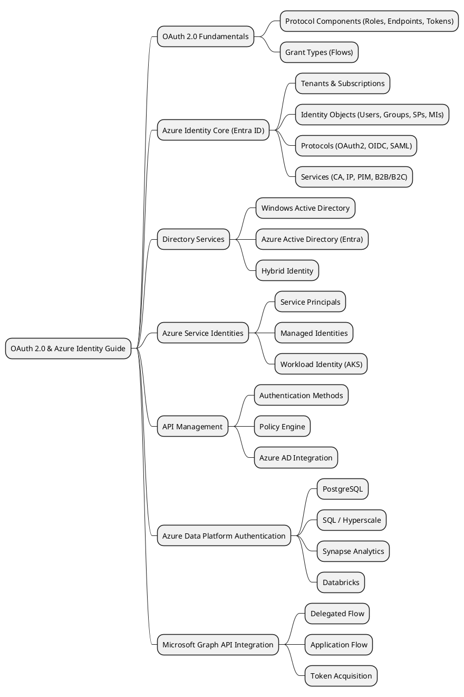

---

## 2. OAuth 2.0 Fundamentals

OAuth 2.0 is an authorization framework that allows a third-party application to obtain limited access to a protected resource on behalf of a resource owner.

### Protocol Components

- **Roles:** Resource Owner, Client, Authorization Server, Resource Server
- **Endpoints:** Authorization, Token, Redirection, Revocation
- **Grant Types:** Authorization Code, Implicit, Client Credentials, Device Code, ROPC, Refresh Token
- **Token Types:** Access Token, Refresh Token, ID Token

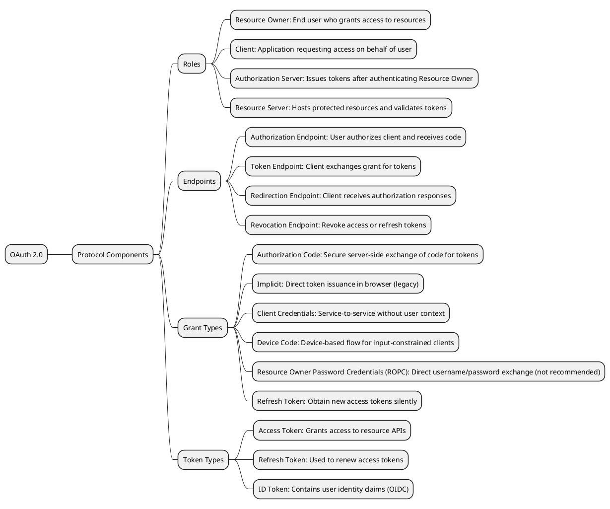

---

## 3. OAuth Flows in Microsoft Identity Platform

The Microsoft Identity Platform supports several OAuth 2.0 flows tailored for different application types and scenarios.

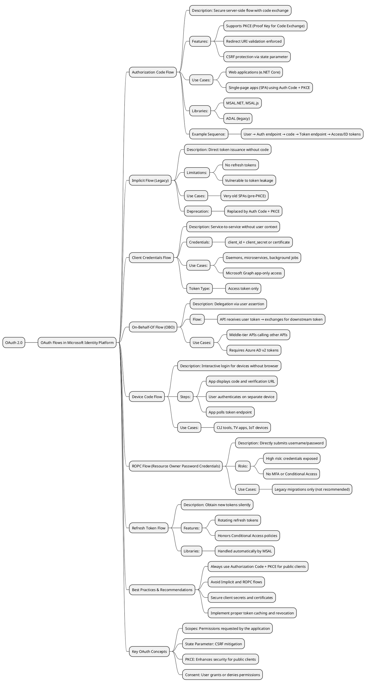

#### Example: Client Credentials Flow

```python
from azure.identity import ClientSecretCredential

tenant_id = "<YOUR_TENANT_ID>"
client_id = "<YOUR_CLIENT_ID>"
client_secret = "<YOUR_CLIENT_SECRET>"

cred = ClientSecretCredential(tenant_id=tenant_id, client_id=client_id, client_secret=client_secret)
scopes = ["https://graph.microsoft.com/.default"]
token = cred.get_token(*scopes)
print(f"Access Token: {token.token}")
```

#### Example: Device Code Flow

```python
from azure.identity import DeviceCodeCredential

client_id = "<YOUR_CLIENT_ID>"
tenant_id = "<YOUR_TENANT_ID>"

cred = DeviceCodeCredential(client_id=client_id, tenant_id=tenant_id)
scopes = ["User.Read"]
token = cred.get_token(*scopes)
print(f"Access Token: {token.token}")
```

#### Example: ROPC Flow (Not Recommended)

```python
from azure.identity import UsernamePasswordCredential

client_id = "<YOUR_CLIENT_ID>"
username = "<YOUR_USERNAME>"
password = "<YOUR_PASSWORD>"
tenant_id = "<YOUR_TENANT_ID>"

cred = UsernamePasswordCredential(
    client_id=client_id,
    username=username,
    password=password,
    tenant_id=tenant_id
)
scopes = ["User.Read"]
token = cred.get_token(*scopes)
print(f"Access Token: {token.token}")
```

---

## 4. Directory Services

Directory services manage identities and resources.

### Windows Active Directory

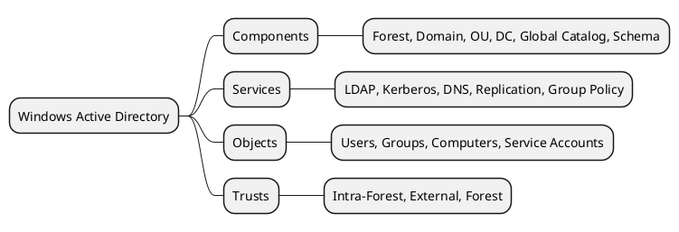

### LDAP Flows

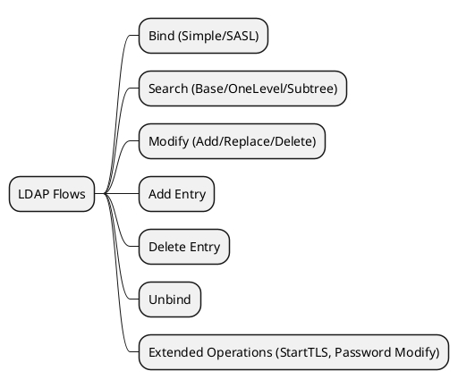

#### Example: Querying LDAP using ldap3

```python
from ldap3 import Server, Connection, ALL, SUBTREE

ldap_server = 'ldap://ad.example.com'
user_dn = 'CN=svc_account,OU=Service Accounts,DC=example,DC=com'
password = 'P@ssw0rd'
base_dn = 'DC=example,DC=com'
search_filter = '(objectClass=user)'
attributes = ['cn', 'mail', 'memberOf']

server = Server(ldap_server, get_info=ALL)
conn = Connection(server, user=user_dn, password=password, auto_bind=True)

if conn.bind():
    print("LDAP Bind successful")
    conn.search(
        search_base=base_dn,
        search_filter=search_filter,
        search_scope=SUBTREE,
        attributes=attributes
    )
    print(f"Found {len(conn.entries)} entries:")
    for entry in conn.entries:
        print('CN:', entry.cn)
        print('Email:', entry.mail)
        print('Groups:', entry.memberOf)
        print('---')
    conn.unbind()
    print("LDAP Unbind successful")
else:
    print(f"LDAP Bind failed: {conn.result}")
```

### Azure Active Directory (Entra)

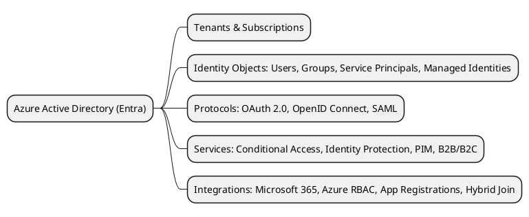

### Hybrid Identity

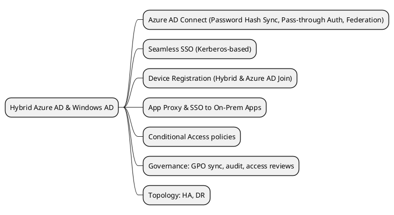

---

## 5. Azure Service Identities

Identities for applications and services to access Azure resources.

### Azure Service Identities

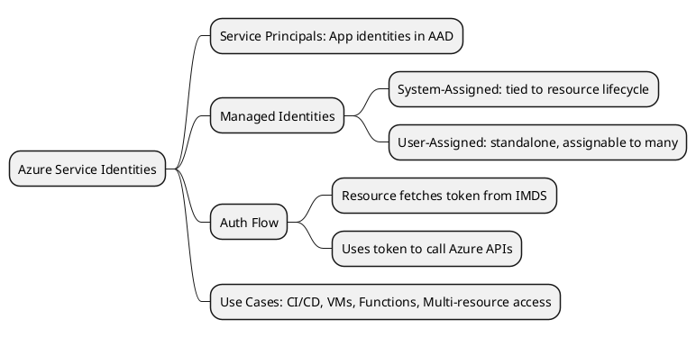

#### Example: Using DefaultAzureCredential

```python
from azure.identity import DefaultAzureCredential
from azure.keyvault.secrets import SecretClient

credential = DefaultAzureCredential()
key_vault_url = "https://your-key-vault.vault.azure.net"
secret_client = SecretClient(vault_url=key_vault_url, credential=credential)

secret_name = "your-secret-name"
try:
    retrieved_secret = secret_client.get_secret(secret_name)
    print(f"Retrieved secret value: {retrieved_secret.value}")
except Exception as e:
    print(f"Error retrieving secret: {e}")
```

### Workload Identity (AKS)

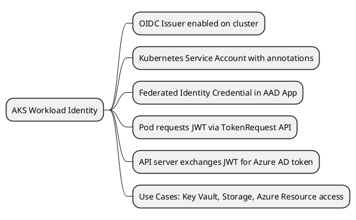

### AKS Cluster Authentication

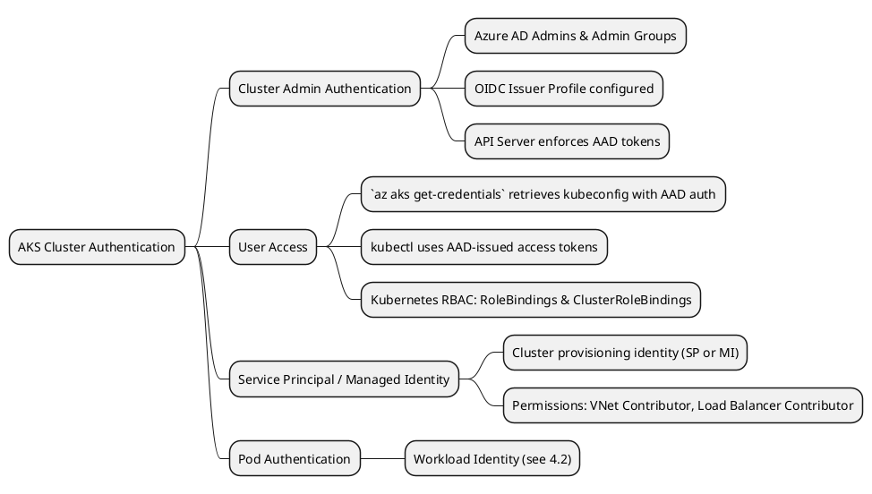

---

## 6. API Management

Azure API Management (APIM) provides authentication and authorization mechanisms for APIs.

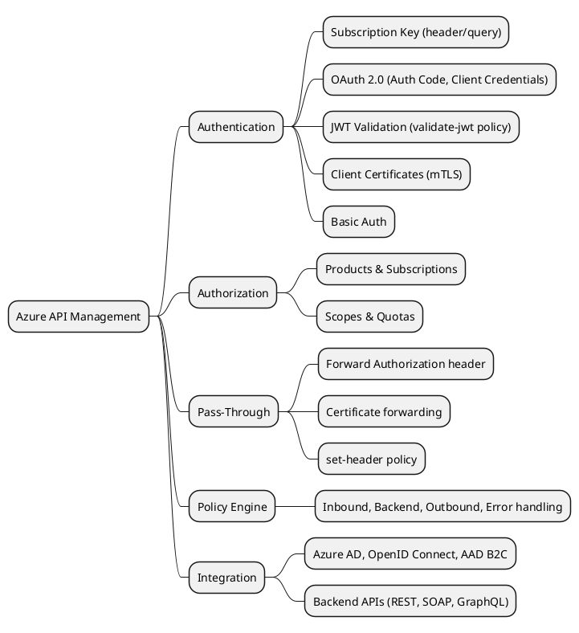

#### Example: Calling an API secured with a Subscription Key

```python
import requests

api_url = "https://your-api-management.azure-api.net/your-api-path"
subscription_key = "YOUR_SUBSCRIPTION_KEY"

headers = {
    "Ocp-Apim-Subscription-Key": subscription_key,
    "Content-Type": "application/json"
}

try:
    response = requests.get(api_url, headers=headers)
    response.raise_for_status()
    print(f"Response Status Code: {response.status_code}")
    print("Response Body:")
    print(response.json())
except requests.exceptions.RequestException as e:
    print(f"Error calling API: {e}")
```

#### Example: Calling an API secured with Azure AD (OAuth 2.0)

```python
import requests
from azure.identity import DefaultAzureCredential

api_url = "https://your-api-management.azure-api.net/your-api-path"
scopes = ["api://<YOUR_API_CLIENT_ID>/.default"]

credential = DefaultAzureCredential()

try:
    token = credential.get_token(*scopes).token
    headers = {
        "Authorization": f"Bearer {token}",
        "Content-Type": "application/json"
    }
    response = requests.get(api_url, headers=headers)
    response.raise_for_status()
    print(f"Response Status Code: {response.status_code}")
    print("Response Body:")
    print(response.json())
except Exception as e:
    print(f"Error calling API: {e}")
```

---

## 7. Azure Data Platform Authentication

Azure data services offer various authentication methods, often integrating with Azure AD.

### Azure Database for PostgreSQL Authentication

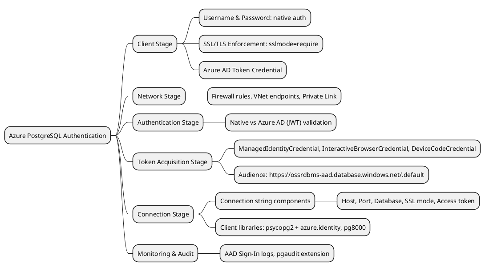

### Azure SQL & Hyperscale

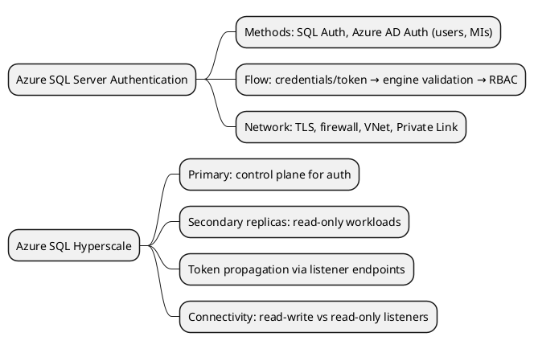

#### Example: Connecting to Azure SQL using Azure AD Token

```python
from azure.identity import DefaultAzureCredential
import pyodbc

server = "your_server.database.windows.net"
database = "your_database"
driver = "ODBC Driver 17 for SQL Server"

credential = DefaultAzureCredential()
try:
    token = credential.get_token("https://database.windows.net/.default").token
    conn_str = (
        f"DRIVER={{{driver}}};"
        f"SERVER={server};"
        f"DATABASE={database};"
        f"Authentication=ActiveDirectoryAccessToken;"
        f"AccessToken={token}"
    )
    conn = pyodbc.connect(conn_str)
    cursor = conn.cursor()
    cursor.execute("SELECT @@VERSION;")
    row = cursor.fetchone()
    while row:
        print(row[0])
        row = cursor.fetchone()
    cursor.close()
    conn.close()
    print("Connection to Azure SQL successful.")
except Exception as e:
    print(f"Error connecting to Azure SQL: {e}")
```

---

## 8. Microsoft Graph API Integration

The Microsoft Graph API provides access to Microsoft 365 data. Authentication uses OAuth 2.0.

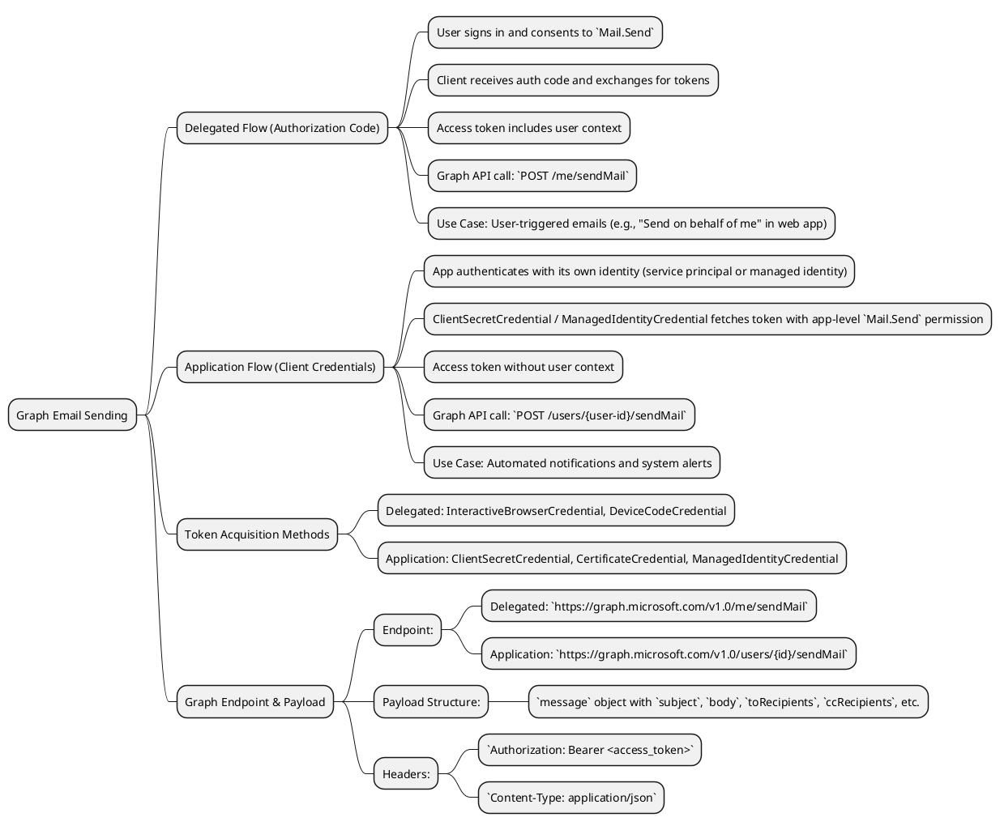

#### Example: Sending Email via Microsoft Graph (Delegated Flow)

```python
from azure.identity import InteractiveBrowserCredential
from msgraph.core import GraphClient

tenant_id = "<YOUR_TENANT_ID>"
client_id = "<YOUR_CLIENT_ID>"

credential = InteractiveBrowserCredential(
    tenant_id=tenant_id,
    client_id=client_id
)
scopes = ["Mail.Send", "User.Read"]
token = credential.get_token(*scopes)

graph_client = GraphClient(credential=credential)
message = {
    "message": {
        "subject": "Hello from Microsoft Graph (Delegated Flow)",
        "body": {"contentType": "Text", "content": "This is a test email sent via the Microsoft Graph API using the Delegated Flow."},
        "toRecipients": [{"emailAddress": {"address": "recipient@example.com"}}]
    },
    "saveToSentItems": "true"
}
response = graph_client.post('/me/sendMail', json=message)
response.raise_for_status()
print(f"Email sent successfully. Response Status Code: {response.status_code}")
```

#### Example: Sending Email via Microsoft Graph (Application Flow)

```python
from azure.identity import ClientSecretCredential
from msgraph.core import GraphClient

tenant_id = "<YOUR_TENANT_ID>"
client_id = "<YOUR_CLIENT_ID>"
client_secret = "<YOUR_CLIENT_SECRET>"

credential = ClientSecretCredential(
    tenant_id=tenant_id,
    client_id=client_id,
    client_secret=client_secret
)
graph_client = GraphClient(credential=credential)
sender_user_id = "<SENDER_USER_ID>"

message = {
    "message": {
        "subject": "Automated Notification from Microsoft Graph (Application Flow)",
        "body": {"contentType": "Text", "content": "This is an automated email sent via the Microsoft Graph API using the Application Flow."},
        "toRecipients": [{"emailAddress": {"address": "recipient@example.com"}}]
    },
    "saveToSentItems": "true"
}

try:
    response = graph_client.post(f'/users/{sender_user_id}/sendMail', json=message)
    response.raise_for_status()
    print(f"Email sent successfully. Response Status Code: {response.status_code}")
except Exception as e:
    print(f"Error sending email via Graph API: {e}")
    print("Please ensure the Service Principal has the application-level 'Mail.Send' permission granted.")
```

---

## 9. Best Practices

1. Always use Authorization Code + PKCE for public clients.
2. Avoid Implicit and ROPC flows.
3. Implement proper token caching and revocation.
4. Use Managed Identities where possible.
5. Rotate client secrets and certificates regularly.
6. Implement Conditional Access policies.
7. Use minimum required permissions (least privilege).

---

## 10. References

1. [OAuth 2.0 RFC 6749](https://datatracker.ietf.org/doc/html/rfc6749)
2. [Azure Identity Documentation](https://docs.microsoft.com/azure/active-directory)
3. [Microsoft Graph API Documentation](https://docs.microsoft.com/graph)

---

_Document Author: Siddhartha Maity (siddhartha.maity@ubs.com)_