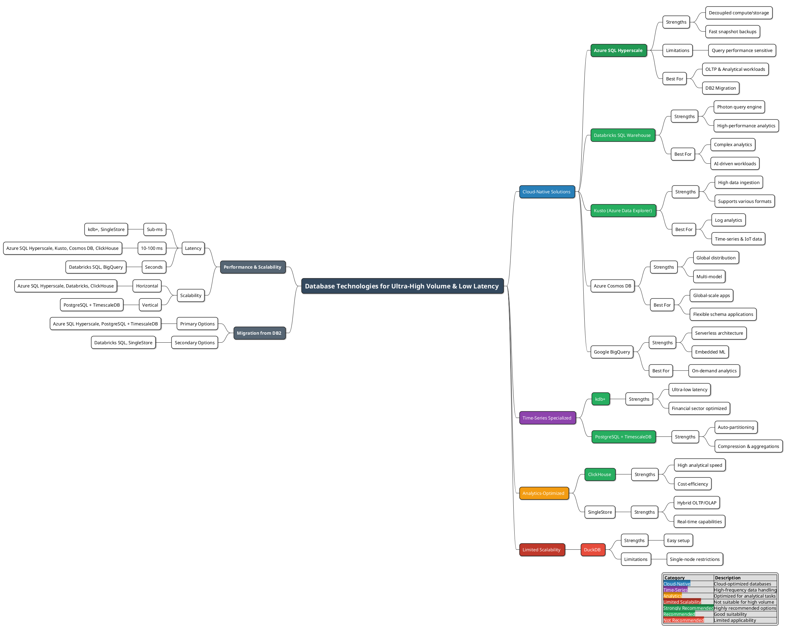
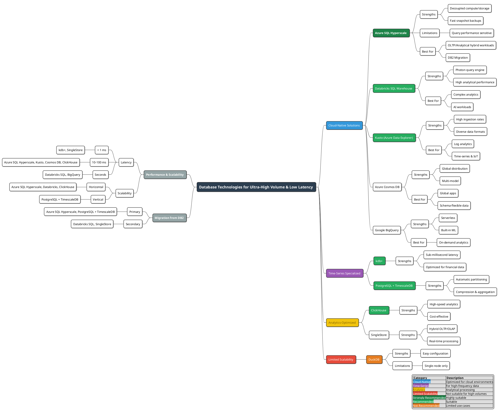

# Database Technologies for Ultra-High Data Volume and Performance

## Executive Summary

The escalating volumes of data generated across various industries necessitate robust database technologies capable of efficiently storing, managing, and querying massive datasets. This report evaluates several database systems with a focus on their suitability for handling extremely high data volumes (approximately 160 billion rows) while maintaining very high query performance (response times between 10-100 milliseconds).

## Introduction

This analysis considers key aspects such as:
- Architecture
- Performance benchmarks
- Scalability
- Limitations
- Use case suitability

Each database technology is evaluated based on available research material and industry benchmarks.

## Overview of Database Technologies

### Summary





### Summary



```puml
@startmindmap
<style>
mindmapDiagram {
  node {
    FontColor black
    FontName Arial
    FontSize 14
    BorderThickness 1.5
    BackgroundColor white
    RoundCorner 10
    shadowing 0.7
  }
    .title {
    BackgroundColor #2C3E50
    FontColor white
    FontSize 18
    BorderThickness 2
    FontStyle bold
  }

  .cloudnative {
    BackgroundColor #42A5F5-#1E88E5
    FontColor white
    BorderColor #1565C0
    BorderThickness 2
  }

  .timeseriescat {
    BackgroundColor #BA68C8-#9C27B0
    FontColor white
    BorderColor #6A1B9A
    BorderThickness 2
  }

  .analyticscat {
    BackgroundColor #FFD54F-#FFC107
    FontColor black
    BorderColor #FFA000
    BorderThickness 2
  }

  .limitedcat {
    BackgroundColor #EF9A9A-#E57373
    FontColor white
    BorderColor #D32F2F
    BorderThickness 2
  }

  .strongrecommend {
    BackgroundColor #66BB6A-#388E3C
    FontColor white
    BorderColor #2E7D32
    BorderThickness 3
    FontStyle bold
  }

  .recommended {
    BackgroundColor #81C784-#66BB6A
    FontColor black
    BorderColor #388E3C
    BorderThickness 2
  }

  .notrecommended {
    BackgroundColor #EF5350-#E53935
    FontColor white
    BorderColor #B71C1C
  }

  .strengths {
    BackgroundColor #C5E1A5-#AED581
    FontColor #33691E
    BorderColor #689F38
  }

  .limitations {
    BackgroundColor #FFAB91-#FF8A65
    FontColor #BF360C
    BorderColor #E64A19
  }

  .bestfor {
    BackgroundColor #4FC3F7-#29B6F6
    FontColor #01579B
    BorderColor #0288D1
  }

  .section {
    BackgroundColor #9FA8DA-#7986CB
    FontColor white
    BorderColor #3949AB
    FontStyle bold
    BorderThickness 2
  }

  .latency {
    BackgroundColor #A5D6A7-#81C784
    FontColor #1B5E20
    BorderColor #388E3C
  }

  .scalability {
    BackgroundColor #B39DDB-#9575CD
    FontColor white
    BorderColor #673AB7
  }

  .models {
    BackgroundColor #81D4FA-#4FC3F7
    FontColor #01579B
    BorderColor #0288D1
  }

  .migration {
    BackgroundColor #FFCC80-#FFB74D
    FontColor #E65100
    BorderColor #FB8C00
  }

  .considerations {
    BackgroundColor #E0E0E0-#BDBDBD
    FontColor #424242
    BorderColor #757575
  }

  .lowcost {
    BackgroundColor #AED581-#9CCC65
    FontColor #33691E
    BorderColor #689F38
  }

  .realtime {
    BackgroundColor #4FC3F7-#29B6F6
    FontColor white
    BorderColor #0288D1
  }

  .columnar {
    BackgroundColor #CE93D8-#AB47BC
    FontColor white
    BorderColor #8E24AA
  }

  .distributed {
    BackgroundColor #FFB74D-#FFA726
    FontColor #BF360C
    BorderColor #FB8C00
  }

  .inmemory {
    BackgroundColor #80DEEA-#4DD0E1
    FontColor #006064
    BorderColor #00ACC1
  }

  .managed {
    BackgroundColor #9FA8DA-#7986CB
    FontColor white
    BorderColor #3949AB
  }

  .serverless {
    BackgroundColor #F48FB1-#F06292
    FontColor white
    BorderColor #D81B60
  }
}
</style>

* <b>Database Technologies for Ultra-High Data Volume (160B rows) and Low Latency (10-100ms)</b> <<title>>
** Cloud-Native Solutions <<cloudnative>>
*** Azure SQL Hyperscale <<strongrecommend>>
**** Strengths <<strengths>>
***** Decoupled compute/storage <<distributed>>
***** Fast backups <<managed>>
***** Read scale-out <<distributed>>
**** Best for <<bestfor>>
***** OLTP/Analytics <<oltp>>

*** Databricks SQL Warehouse <<recommended>>
**** Strengths <<strengths>>
***** Photon engine <<columnar>>
**** Best for <<bestfor>>
***** AI analytics <<olap>>

** Time-Series Specialized <<timeseriescat>>
*** kdb+ <<recommended>>
**** Strengths <<strengths>>
***** Low latency <<inmemory>>

** Analytics-Optimized <<analyticscat>>
*** ClickHouse <<recommended>>
**** Strengths <<strengths>>
***** Columnar storage <<columnar>>

** Limited Scalability <<limitedcat>>
*** DuckDB <<notrecommended>>

left side
** Performance Considerations <<section>>
*** Query Latency Requirements <<latency>>
*** Scalability Patterns <<scalability>>
*** Data Models <<models>>
*** Storage Type

** DB2 Migration Recommendations <<migration>>
*** Primary Candidates <<strongrecommend>>
*** Secondary Options <<recommended>>
*** Migration Considerations <<considerations>>
*** Cost Efficiency <<lowcost>>

@endmindmap

```

### Details

```puml
@startmindmap
<style>
mindmapDiagram {
  node {
    FontColor black
    FontName Arial
    FontSize 14
    BorderThickness 1.5
    BackgroundColor white
    RoundCorner 10
    shadowing 0.5
  }
    .title {
    BackgroundColor #2C3E50
    FontColor white
    FontSize 18
    BorderThickness 2
    FontStyle bold
  }
  .cloud {
    BackgroundColor #BBDEFB-#90CAF9
    FontColor #0D47A1
    BorderColor #1976D2
  }
  .azure {
    BackgroundColor #0078D4-#0063B1
    FontColor white
    BorderColor #004E8C
  }
  .onprem {
    BackgroundColor #FFCCBC-#FFAB91
    FontColor #BF360C
    BorderColor #E64A19
  }
  .hybrid {
    BackgroundColor #C8E6C9-#A5D6A7
    FontColor #1B5E20
    BorderColor #388E3C
  }
  .timeseries {
    BackgroundColor #E1BEE7-#CE93D8
    FontColor #4A148C
    BorderColor #8E24AA
  }
  .analytics {
    BackgroundColor #FFF9C4-#FFF59D
    FontColor #F57F17
    BorderColor #FBC02D
  }
  .general {
    BackgroundColor #E0E0E0-#BDBDBD
    FontColor #212121
    BorderColor #757575
  }
  .strengths {
    BackgroundColor #DCEDC8-#C5E1A5
    FontColor #33691E
    BorderColor #689F38
  }
  .limitations {
    BackgroundColor #FFCCBC-#FFAB91
    FontColor #BF360C
    BorderColor #E64A19
  }
  .bestfor {
    BackgroundColor #B3E5FC-#81D4FA
    FontColor #01579B
    BorderColor #039BE5
  }
  .scalability {
    BackgroundColor #D1C4E9-#B39DDB
    FontColor #311B92
    BorderColor #673AB7
  }
  .considerations {
    BackgroundColor #F5F5F5-#E0E0E0
    FontColor #424242
    BorderColor #9E9E9E
  }
  .recommended {
    BackgroundColor #A5D6A7-#81C784
    FontColor #1B5E20
    BorderColor #2E7D32
    BorderThickness 2
  }
  .strongrecommend {
    BackgroundColor #66BB6A-#4CAF50
    FontColor white
    BorderColor #2E7D32
    BorderThickness 3
    FontStyle bold
  }
  .notrecommended {
    BackgroundColor #EF9A9A-#E57373
    FontColor #B71C1C
    BorderColor #D32F2F
  }
  .performance {
    BackgroundColor #BBDEFB-#90CAF9
    FontColor #0D47A1
    BorderColor #1976D2
  }
  .latency {
    BackgroundColor #C8E6C9-#A5D6A7
    FontColor #1B5E20
    BorderColor #388E3C
  }
  .migration {
    BackgroundColor #FFE0B2-#FFCC80
    FontColor #E65100
    BorderColor #FB8C00
  }
  .models {
    BackgroundColor #B3E5FC-#81D4FA
    FontColor #01579B
    BorderColor #039BE5
  }
  
  ' New capability-based styles
  .columnar {
    BackgroundColor #D1C4E9-#B39DDB
    FontColor #4A148C
    BorderColor #673AB7
    FontStyle italic
  }
  .distributed {
    BackgroundColor #FFECB3-#FFE082
    FontColor #FF6F00
    BorderColor #FFA000
    FontStyle italic
  }
  .inmemory {
    BackgroundColor #B2EBF2-#80DEEA
    FontColor #006064
    BorderColor #00ACC1
    FontStyle italic
  }
  .managed {
    BackgroundColor #C5CAE9-#9FA8DA
    FontColor #1A237E
    BorderColor #3949AB
    FontStyle italic
  }
  .serverless {
    BackgroundColor #F8BBD0-#F48FB1
    FontColor #880E4F
    BorderColor #D81B60
    FontStyle italic
  }
  .oltp {
    BackgroundColor #FFCCBC-#FFAB91
    FontColor #BF360C
    BorderColor #E64A19
    FontStyle italic
  }
  .olap {
    BackgroundColor #FFF9C4-#FFF59D
    FontColor #F57F17
    BorderColor #FBC02D
    FontStyle italic
  }
  .realtime {
    BackgroundColor #B3E5FC-#81D4FA
    FontColor #01579B
    BorderColor #039BE5
    FontStyle italic
  }
  .lowcost {
    BackgroundColor #C8E6C9-#A5D6A7
    FontColor #1B5E20
    BorderColor #388E3C
    FontStyle italic
  }
  .parallel {
    BackgroundColor #E1BEE7-#CE93D8
    FontColor #4A148C
    BorderColor #8E24AA
    FontStyle italic
  }
  
  ' Left-side category styles
  .cloudnative {
    BackgroundColor #B3E5FC-#42A5F5
    FontColor #01579B
    BorderColor #1976D2
    BorderThickness 2
  }
  .timeseriescat {
    BackgroundColor #E1BEE7-#BA68C8
    FontColor #4A148C
    BorderColor #8E24AA
    BorderThickness 2
  }
  .analyticscat {
    BackgroundColor #FFF59D-#FFD54F
    FontColor #F57F17
    BorderColor #FFA000
    BorderThickness 2
  }
  .limitedcat {
    BackgroundColor #FFCDD2-#EF9A9A
    FontColor #B71C1C
    BorderColor #D32F2F
    BorderThickness 2
  }
  .section {
    BackgroundColor #E8EAF6-#C5CAE9
    FontColor #1A237E
    BorderColor #3F51B5
    BorderThickness 2
    FontStyle bold
  }
}
</style>

* <b>Database Technologies for\nUltra-High Data Volume (160B rows)\nand Low Latency (10-100ms)</b> <<title>>
** <&cloud> Cloud-Native Solutions <<cloudnative>>
*** <&cloud> Azure SQL Hyperscale <<strongrecommend>>
**** <&plus> Strengths <<strengths>>
***** Decoupled compute and storage (up to 128 TB) <<distributed>>
***** Fast snapshot-based backups <<managed>>
***** Read scale-out capabilities <<distributed>>
***** High transaction log throughput <<oltp>>
**** <&minus> Limitations <<limitations>>
***** Affected by poorly written queries
***** SSD cache dependency
***** Log rate governance
**** <&star> Best for <<bestfor>>
***** OLTP and analytical hybrid workloads <<oltp>>
***** DB2 migration target <<strongrecommend>>
***** Familiar SQL environment
***** Enterprise features <<managed>>


*** <&cloud> Databricks SQL Warehouse <<recommended>>
**** <&plus> Strengths <<strengths>>
***** Photon vectorized query engine <<parallel>>
***** Record-setting TPC-DS performance <<olap>>
***** Intelligent workload management <<managed>>
**** <&minus> Limitations <<limitations>>
***** UDF performance issues
***** Metadata caching challenges
**** <&star> Best for <<bestfor>>
***** Data lakes
***** AI-driven workloads
***** Complex analytics <<olap>> 
***** DB2 migration candidate <<recommended>>
***** Open source alternative <<lowcost>>


*** <&cloud> Kusto Cluster (Azure Data Explorer) <<recommended>>
**** <&plus> Strengths <<strengths>>
***** High-throughput data ingestion <<distributed>>
***** Support for diverse data formats
***** Hot caching & optimized indexing <<inmemory>>
**** <&star> Best for <<bestfor>>
***** Log analytics <<olap>>
***** Time-series data <<realtime>>
***** IoT telemetry <<realtime>>

*** <&cloud> Azure Cosmos DB <<azure>>
**** <&plus> Strengths <<strengths>>
***** Global distribution <<distributed>>
***** Multi-model support
***** SLA-backed performance <<managed>>
**** <&minus> Limitations <<limitations>>
***** 10GB per logical partition
***** Cost scales with throughput
**** <&star> Best for <<bestfor>>
***** Globally distributed applications <<distributed>>
***** Schema-flexible workloads
***** Multi-model data <<distributed>>

*** <&cloud> Google BigQuery <<cloud>>
**** <&plus> Strengths <<strengths>>
***** Serverless architecture <<serverless>>
***** Automatic resource provisioning <<managed>>
***** Built-in ML capabilities
**** <&star> Best for <<bestfor>>
***** On-demand analytics <<olap>>
***** Sporadic workload patterns <<serverless>>
***** Cost-effective for large datasets <<lowcost>>
**** <&minus> Limitations <<limitations>>
***** Cold start latency
***** Limited real-time capabilities
***** Query cost management
***** SQL dialect differences

** <&clock> Time-Series Specialized <<timeseriescat>>
*** <&clock> kdb+ <<recommended>>
**** <&plus> Strengths <<strengths>>
***** Sub-millisecond latency <<inmemory>>
***** Superior benchmarks <<realtime>>
***** Memory-mapped files <<inmemory>>
***** "q" query language
**** <&star> Best for <<bestfor>>
***** Financial trading <<realtime>>
***** High-frequency analytics <<olap>>
***** Real-time data feeds <<realtime>>
**** <&minus> Limitations <<limitations>>
***** Proprietary license
***** Steep learning curve
***** Limited ecosystem

*** <&clock> Azure PostgreSQL with TimescaleDB <<recommended>>
**** <&plus> Strengths <<strengths>>
***** Automatic partitioning (hypertables) <<distributed>>
***** Columnar compression <<columnar>>
***** Continuous aggregates <<olap>>
**** <&star> Best for <<bestfor>>
***** Time-series at scale <<realtime>>
***** Familiar SQL environment
***** DB2 migration candidate <<recommended>>
***** Open source alternative <<lowcost>>
*** <&clock> InfluxDB <<recommended>>
**** <&plus> Strengths <<strengths>>
***** High write throughput <<distributed>>
***** Compression and downsampling <<columnar>>
***** SQL-like query language



** <&chart> Analytics-Optimized <<analyticscat>>
*** <&chart> ClickHouse <<recommended>>
**** <&plus> Strengths <<strengths>>
***** Extreme query performance <<columnar>>
***** Columnar storage with compression <<columnar>>
***** Linear scalability <<distributed>>
**** <&star> Best for <<bestfor>>
***** Analytical workloads <<olap>>
***** Real-time dashboards <<realtime>>
***** Cost-effective analytics <<lowcost>>

*** <&chart> SingleStore <<analytics>>
**** <&plus> Strengths <<strengths>>
***** Hybrid storage architecture <<inmemory>>
***** Massively parallel processing <<parallel>>
***** Sub-millisecond latencies <<realtime>>
**** <&star> Best for <<bestfor>>
***** Hybrid OLTP/OLAP <<oltp>>
***** Real-time insights <<realtime>>

** <&ban> Limited Scalability <<limitedcat>>
*** <&ban> DuckDB <<notrecommended>>
**** <&plus> Strengths <<strengths>>
***** Local analytics
***** Minimal configuration <<lowcost>>
**** <&minus> Limitations <<limitations>>
***** Single-node architecture
***** Memory constraints
***** Not suitable for 160B rows

left side

** <&cog> Performance Considerations <<section>>
*** <&timer> Query Latency Requirements <<latency>>
**** <&bolt> Sub-millisecond <<realtime>>
***** kdb+ <<inmemory>>
***** SingleStore <<inmemory>>
**** <&bolt> 10-100ms <<realtime>>
***** Azure SQL Hyperscale <<distributed>>
***** Kusto Cluster <<distributed>>
***** Cosmos DB <<distributed>>
***** ClickHouse <<columnar>>
**** <&clock> Seconds to minutes
***** Databricks SQL Warehouse <<olap>>
***** Google BigQuery <<serverless>>

*** <&resize-both> Scalability Patterns <<scalability>>
**** <&share> Horizontal Scaling <<distributed>>
***** Azure SQL Hyperscale
***** Databricks SQL Warehouse
***** Kusto Cluster
***** ClickHouse
***** Cosmos DB
**** <&layers> Vertical Scaling
***** PostgreSQL with TimescaleDB
***** DuckDB (limited)

*** <&layers> Data Models <<models>>
**** <&spreadsheet> Relational
***** Azure SQL Hyperscale <<oltp>>
***** Databricks SQL Warehouse <<olap>>
***** PostgreSQL with TimescaleDB <<realtime>>
***** SingleStore <<oltp>>
**** <&sort-numeric> Columnar/Time-Series <<columnar>>
***** kdb+ <<inmemory>>
***** ClickHouse <<distributed>>
***** Kusto Cluster <<distributed>>
**** <&list> Multi-Model
***** Cosmos DB <<distributed>>

*** <&cog> Storage Type
**** <&memory> In-Memory Optimized <<inmemory>>
***** kdb+
***** SingleStore
***** Kusto Cluster (hot cache)
**** <&hard-drive> Disk-Based
***** Azure SQL Hyperscale
***** Databricks SQL Warehouse
***** PostgreSQL with TimescaleDB
**** <&cloud-download> Decoupled Storage/Compute <<distributed>>
***** Azure SQL Hyperscale
***** Databricks SQL Warehouse
***** Google BigQuery <<serverless>>

** <&transfer> DB2 Migration Recommendations <<migration>>
*** Primary Candidates <<strongrecommend>>
**** <&check> Azure SQL Hyperscale
***** Familiar SQL semantics
***** Enterprise features <<managed>>
***** Managed service <<managed>>
**** <&check> PostgreSQL with TimescaleDB
***** Open source alternative <<lowcost>>
***** SQL compatibility
***** Extensions ecosystem

*** Secondary Options <<recommended>>
**** <&thumb-up> Databricks SQL Warehouse
***** For analytics-heavy workloads <<olap>>
**** <&thumb-up> SingleStore
***** For hybrid transaction/analytics <<oltp>>

*** <&cog> Migration Considerations <<considerations>>
**** Schema conversion
**** Query optimization
**** ETL pipelines
**** Performance testing
**** Cost analysis <<lowcost>>

*** <&dollar> Cost Efficiency <<lowcost>>
**** Low Total Cost of Ownership
***** ClickHouse (open source)
***** PostgreSQL with TimescaleDB
**** Pay-As-You-Go
***** Google BigQuery <<serverless>>
***** Azure SQL Hyperscale (autoscale)
**** High Throughput/Cost Ratio
***** SingleStore
***** Databricks SQL Warehouse

legend right
  <b>Color Legend</b>
  |= <back:#FFFFFF> <color:black> Category </color> </back> |= <back:#FFFFFF> <color:black> Description </color> </back> |
  | <back:#0078D4-#0063B1> <color:white> Azure Services </color> </back> | Microsoft Azure native services |
  | <back:#B3E5FC-#42A5F5> <color:#01579B> Cloud-Native Solutions </color> </back> | Best scalable cloud options |
  | <back:#E1BEE7-#BA68C8> <color:#4A148C> Time-Series Specialized </color> </back> | Optimized for time-series data |
  | <back:#FFF59D-#FFD54F> <color:#F57F17> Analytics-Optimized </color> </back> | Analytics-focused platforms |
  | <back:#FFCDD2-#EF9A9A> <color:#B71C1C> Limited Scalability </color> </back> | Not recommended for ultra-high volume |
  | <back:#66BB6A-#4CAF50> <color:white> Recommended for DB2 Migration </color> </back> | Best DB2 alternatives |
  
  <b>Capability Legend</b>
  |= <back:#FFFFFF> <color:black> Capability </color> </back> |= <back:#FFFFFF> <color:black> Description </color> </back> |
  | <back:#D1C4E9-#B39DDB> <color:#4A148C> <i>Columnar Storage</i> </color> </back> | Column-oriented data organization |
  | <back:#FFECB3-#FFE082> <color:#FF6F00> <i>Distributed Architecture</i> </color> </back> | Scales across multiple nodes |
  | <back:#B2EBF2-#80DEEA> <color:#006064> <i>In-Memory Processing</i> </color> </back> | Optimized for RAM-based operations |
  | <back:#C5CAE9-#9FA8DA> <color:#1A237E> <i>Managed Service</i> </color> </back> | Reduced operational overhead |
  | <back:#F8BBD0-#F48FB1> <color:#880E4F> <i>Serverless</i> </color> </back> | On-demand resource allocation |
  | <back:#FFCCBC-#FFAB91> <color:#BF360C> <i>OLTP Support</i> </color> </back> | Transaction processing capabilities |
  | <back:#FFF9C4-#FFF59D> <color:#F57F17> <i>OLAP Support</i> </color> </back> | Analytical processing capabilities |
  | <back:#B3E5FC-#81D4FA> <color:#01579B> <i>Real-time Processing</i> </color> </back> | Low-latency query responses |
  | <back:#C8E6C9-#A5D6A7> <color:#1B5E20> <i>Cost Efficiency</i> </color> </back> | Lower TCO or flexible pricing |
endlegend
@endmindmap 
```


```puml
@startmindmap
<style>
mindmapDiagram {
  .rootNode {
    FontSize 16
    FontStyle bold
  }
  node {
    FontColor black
    FontName Arial
    FontSize 14
    BorderThickness 1.5
    BackgroundColor white
    RoundCorner 10
    shadowing 0.5
    Padding 5
    Margin 10
  }
  arrow {
    LineThickness 1.5
  }

  ' Base Category Styles
  .cloud {
    BackgroundColor #BBDEFB-#90CAF9
    FontColor #0D47A1
    BorderColor #1976D2
  }
    .title {
    BackgroundColor #2C3E50
    FontColor white
    FontSize 18
    BorderThickness 2
    FontStyle bold
  }
  .azure {
    BackgroundColor #0078D4-#0063B1
    FontColor white
    BorderColor #004E8C
  }
  .timeseries {
    BackgroundColor #E1BEE7-#CE93D8
    FontColor #4A148C
    BorderColor #8E24AA
  }
  .analytics {
    BackgroundColor #FFF9C4-#FFF59D
    FontColor #F57F17
    BorderColor #FBC02D
  }
  .general {
    BackgroundColor #E0E0E0-#BDBDBD
    FontColor #212121
    BorderColor #757575
  }
  
  ' Node State/Attribute Styles
  .strengths {
    BackgroundColor #DCEDC8-#C5E1A5
    FontColor #33691E
    BorderColor #689F38
  }
  .limitations {
    BackgroundColor #FFCCBC-#FFAB91
    FontColor #BF360C
    BorderColor #E64A19
  }
  .bestfor {
    BackgroundColor #B3E5FC-#81D4FA
    FontColor #01579B
    BorderColor #039BE5
  }
  .scalability {
    BackgroundColor #D1C4E9-#B39DDB
    FontColor #311B92
    BorderColor #673AB7
  }
  .considerations {
    BackgroundColor #F5F5F5-#E0E0E0
    FontColor #424242
    BorderColor #9E9E9E
  }
  .performance {
    BackgroundColor #BBDEFB-#90CAF9
    FontColor #0D47A1
    BorderColor #1976D2
  }
  .latency {
    BackgroundColor #C8E6C9-#A5D6A7
    FontColor #1B5E20
    BorderColor #388E3C
  }
  .migration {
    BackgroundColor #FFE0B2-#FFCC80
    FontColor #E65100
    BorderColor #FB8C00
  }
  .models {
    BackgroundColor #B3E5FC-#81D4FA
    FontColor #01579B
    BorderColor #039BE5
  }

  ' Recommendation Styles
  .recommended {
    BackgroundColor #A5D6A7-#81C784
    FontColor #1B5E20
    BorderColor #2E7D32
    BorderThickness 2
  }
  .strongrecommend {
    BackgroundColor #66BB6A-#4CAF50
    FontColor white
    BorderColor #1B5E20 
    BorderThickness 3
    FontStyle bold
  }
  .notrecommended {
    BackgroundColor #EF9A9A-#E57373
    FontColor #B71C1C
    BorderColor #C62828 
    BorderThickness 2
  }

  ' Capability-based styles (using italics for differentiation)
  .columnar { BackgroundColor #D1C4E9-#B39DDB; FontColor #4A148C; BorderColor #673AB7; FontStyle italic }
  .distributed { BackgroundColor #FFECB3-#FFE082; FontColor #FF6F00; BorderColor #FFA000; FontStyle italic }
  .inmemory { BackgroundColor #B2EBF2-#80DEEA; FontColor #006064; BorderColor #00ACC1; FontStyle italic }
  .managed { BackgroundColor #C5CAE9-#9FA8DA; FontColor #1A237E; BorderColor #3949AB; FontStyle italic }
  .serverless { BackgroundColor #F8BBD0-#F48FB1; FontColor #880E4F; BorderColor #D81B60; FontStyle italic }
  .oltp { BackgroundColor #FFCCBC-#FFAB91; FontColor #BF360C; BorderColor #E64A19; FontStyle italic }
  .olap { BackgroundColor #FFF9C4-#FFF59D; FontColor #F57F17; BorderColor #FBC02D; FontStyle italic }
  .realtime { BackgroundColor #B3E5FC-#81D4FA; FontColor #01579B; BorderColor #039BE5; FontStyle italic }
  .lowcost { BackgroundColor #C8E6C9-#A5D6A7; FontColor #1B5E20; BorderColor #388E3C; FontStyle italic }
  .parallel { BackgroundColor #E1BEE7-#CE93D8; FontColor #4A148C; BorderColor #8E24AA; FontStyle italic }

  ' Left-side category styles
  .cloudnative { BackgroundColor #B3E5FC-#42A5F5; FontColor #01579B; BorderColor #1976D2; BorderThickness 2.5; }
  .timeseriescat { BackgroundColor #E1BEE7-#BA68C8; FontColor #4A148C; BorderColor #8E24AA; BorderThickness 2.5; }
  .analyticscat { BackgroundColor #FFF59D-#FFD54F; FontColor #F57F17; BorderColor #FFA000; BorderThickness 2.5; }
  .limitedcat { BackgroundColor #FFCDD2-#EF9A9A; FontColor #B71C1C; BorderColor #D32F2F; BorderThickness 2.5; }
  
  ' Section Header Style (Left Side)
  .section {
    BackgroundColor #E8EAF6-#C5CAE9
    FontColor #1A237E
    BorderColor #3F51B5
    BorderThickness 2.5
    FontStyle bold
    FontSize 15
  }
}
</style>

* <b>Database Technologies for\nUltra-High Data Volume (160B rows)\nand Low Latency (10-100ms)</b> <<title>>
** <&cloud> Cloud-Native Solutions <<cloudnative>>
*** <&cloud> Azure SQL Hyperscale <<strongrecommend>>
**** <&plus> Strengths <<strengths>>
***** Decoupled compute and storage (up to 128 TB) <<distributed>>
***** Fast snapshot-based backups <<managed>>
***** Read scale-out capabilities <<distributed>>
***** High transaction log throughput <<oltp>>
**** <&minus> Limitations <<limitations>>
***** Affected by poorly written queries
***** SSD cache dependency
***** Log rate governance
**** <&star> Best for <<bestfor>>
***** OLTP and analytical hybrid workloads <<oltp>>
***** DB2 migration target <<strongrecommend>>
***** Familiar SQL environment
***** Enterprise features <<managed>>

*** <&cloud> Databricks SQL Warehouse <<recommended>>
**** <&plus> Strengths <<strengths>>
***** Photon vectorized query engine <<parallel>>
***** Record-setting TPC-DS performance <<olap>>
***** Intelligent workload management <<managed>>
**** <&minus> Limitations <<limitations>>
***** UDF performance issues
***** Metadata caching challenges
**** <&star> Best for <<bestfor>>
***** Data lakes & Lakehouse architecture
***** AI-driven workloads
***** Complex analytics <<olap>>
***** DB2 migration candidate <<recommended>>
***** Open source alternative <<lowcost>>

*** <&cloud> Kusto Cluster (Azure Data Explorer) <<recommended>>
**** <&plus> Strengths <<strengths>>
***** High-throughput data ingestion <<distributed>>
***** Support for diverse data formats
***** Hot caching & optimized indexing <<inmemory>> <<columnar>>
**** <&star> Best for <<bestfor>>
***** Log analytics <<olap>>
***** Time-series data <<realtime>>
***** IoT telemetry <<realtime>>

*** <&cloud> Azure Cosmos DB <<azure>>
**** <&plus> Strengths <<strengths>>
***** Global distribution <<distributed>>
***** Multi-model support
***** SLA-backed performance <<managed>>
**** <&minus> Limitations <<limitations>>
***** 10GB per logical partition limit
***** Cost scales with RU/s (throughput)
**** <&star> Best for <<bestfor>>
***** Globally distributed applications <<distributed>>
***** Schema-flexible workloads
***** Multi-model data needs <<distributed>>

*** <&cloud> Google BigQuery <<cloud>>
**** <&plus> Strengths <<strengths>>
***** Serverless architecture <<serverless>>
***** Automatic resource provisioning <<managed>>
***** Built-in ML capabilities <<olap>>
**** <&star> Best for <<bestfor>>
***** On-demand analytics <<olap>>
***** Sporadic workload patterns <<serverless>>
***** Cost-effective for large datasets <<lowcost>>
**** <&minus> Limitations <<limitations>>
***** Potential cold start latency
***** Limited real-time update/delete
***** Query cost management complexity
***** SQL dialect differences

** <&clock> Time-Series Specialized <<timeseriescat>>
*** <&clock> kdb+ <<recommended>>
**** <&plus> Strengths <<strengths>>
***** Sub-millisecond latency <<inmemory>> <<realtime>>
***** Superior benchmarks for specific workloads <<realtime>>
***** Memory-mapped files for speed <<inmemory>>
***** Powerful "q" query language
**** <&star> Best for <<bestfor>>
***** Financial trading platforms <<realtime>>
***** High-frequency analytics <<olap>>
***** Real-time data stream processing <<realtime>>
**** <&minus> Limitations <<limitations>>
***** Proprietary license cost
***** Steep learning curve for "q"
***** Smaller ecosystem vs SQL

*** <&clock> Azure PostgreSQL with TimescaleDB <<recommended>>
**** <&plus> Strengths <<strengths>>
***** Automatic partitioning (hypertables) <<distributed>>
***** Columnar compression <<columnar>>
***** Continuous aggregates for faster queries <<olap>>
***** Mature PostgreSQL ecosystem <<managed>>
**** <&star> Best for <<bestfor>>
***** Time-series data at scale <<realtime>>
***** Familiar SQL interface
***** DB2 migration candidate <<recommended>>
***** Robust open source option <<lowcost>>

*** <&clock> InfluxDB <<recommended>>
**** <&plus> Strengths <<strengths>>
***** High write throughput design <<distributed>>
***** Efficient compression and downsampling <<columnar>>
***** Purpose-built time-series functions
***** SQL-like query language (Flux or InfluxQL)
**** <&star> Best for <<bestfor>>
***** Monitoring & Metrics <<realtime>>
***** IoT Sensor Data <<realtime>>
***** Real-time Analytics Dashboards <<olap>>

** <&chart> Analytics-Optimized <<analyticscat>>
*** <&chart> ClickHouse <<recommended>>
**** <&plus> Strengths <<strengths>>
***** Extreme query performance on large datasets <<columnar>> <<parallel>>
***** Excellent data compression <<columnar>>
***** Linear scalability <<distributed>>
***** Open Source <<lowcost>>
**** <&star> Best for <<bestfor>>
***** Interactive analytical workloads <<olap>>
***** Real-time reporting dashboards <<realtime>>
***** Cost-effective large-scale analytics <<lowcost>>

*** <&chart> SingleStore (formerly MemSQL) <<analytics>>
**** <&plus> Strengths <<strengths>>
***** Hybrid Row/Columnar storage <<inmemory>> <<columnar>>
***** Massively parallel processing (MPP) <<parallel>>
***** Low latency for transactional & analytical queries <<realtime>> <<oltp>> <<olap>>
**** <&star> Best for <<bestfor>>
***** Hybrid Transactional/Analytical Processing (HTAP) <<oltp>> <<olap>>
***** Real-time operational insights <<realtime>>
***** Applications needing fast ingest and query

** <&ban> Limited Scalability for This Use Case <<limitedcat>>
*** <&ban> DuckDB <<notrecommended>>
**** <&plus> Strengths <<strengths>>
***** Fast local analytics on single machine <<olap>>
***** Easy deployment, no server needed <<lowcost>>
***** Reads multiple formats directly
**** <&minus> Limitations <<limitations>>
***** Primarily single-node architecture
***** Limited by single machine memory/CPU
***** Not designed for 160B+ rows concurrently or distributed compute <<notrecommended>>

left side

** <&cog> Key Considerations <<section>>
*** <&timer> Query Latency Needs <<latency>>
**** <&bolt> Sub-millisecond <<realtime>>
***** kdb+ <<inmemory>>
***** SingleStore <<inmemory>>
**** <&bolt> Low Milliseconds (10-100ms) <<realtime>>
***** Azure SQL Hyperscale (cached reads) <<distributed>>
***** Kusto Cluster (hot cache) <<distributed>>
***** Cosmos DB (point reads) <<distributed>>
***** ClickHouse (optimized queries) <<columnar>>
**** <&clock> Seconds to Minutes
***** Databricks SQL Warehouse (complex analytics) <<olap>>
***** Google BigQuery (cold queries) <<serverless>>
***** PostgreSQL with TimescaleDB (complex queries)

*** <&resize-both> Scalability Approach <<scalability>>
**** <&share> Horizontal Scaling (Distributed) <<distributed>>
***** Azure SQL Hyperscale (read replicas, storage)
***** Databricks SQL Warehouse (clusters)
***** Kusto Cluster (nodes)
***** ClickHouse (sharding/replication)
***** Cosmos DB (partitions)
***** Google BigQuery (managed serverless) <<serverless>>
**** <&layers> Vertical Scaling (Single Node Power)
***** PostgreSQL with TimescaleDB (node size)
***** kdb+ (single server performance focus)
***** DuckDB (single node limit) <<notrecommended>>

*** <&layers> Primary Data Model <<models>>
**** <&spreadsheet> Relational
***** Azure SQL Hyperscale <<oltp>>
***** Databricks SQL Warehouse (SQL interface) <<olap>>
***** PostgreSQL with TimescaleDB <<realtime>>
***** SingleStore <<oltp>> <<olap>>
**** <&sort-numeric> Columnar / Time-Series <<columnar>>
***** kdb+ <<inmemory>> <<realtime>>
***** ClickHouse <<distributed>> <<olap>>
***** Kusto Cluster <<distributed>> <<realtime>>
***** InfluxDB <<distributed>> <<realtime>>
**** <&list> Multi-Model / NoSQL
***** Cosmos DB (Document, Key-Value, Graph, Column) <<distributed>>

*** <&database> Storage Architecture
**** <&memory> In-Memory Optimized <<inmemory>>
***** kdb+
***** SingleStore (columnstore can be in-memory)
***** Kusto Cluster (hot cache)
**** <&hard-drive> Disk-Based (SSD Optimized)
***** Azure SQL Hyperscale (SSD cache + Blob)
***** Databricks SQL Warehouse (Delta Lake on object storage)
***** PostgreSQL with TimescaleDB
***** ClickHouse
**** <&cloud-download> Decoupled Storage/Compute <<distributed>>
***** Azure SQL Hyperscale
***** Databricks SQL Warehouse
***** Google BigQuery <<serverless>>
***** Kusto Cluster

** <&transfer> DB2 Migration Factors <<migration>>
*** Top Recommendations <<strongrecommend>>
**** <&check> Azure SQL Hyperscale
***** Very high SQL Server compatibility <<oltp>>
***** Strong enterprise features & support <<managed>>
***** Fully managed PaaS <<managed>>
**** <&check> PostgreSQL with TimescaleDB
***** Strong SQL compatibility <<realtime>>
***** Mature open-source option <<lowcost>>
***** Large extension ecosystem
***** Managed options available (Azure DB for PostgreSQL) <<managed>>

*** Strong Alternatives <<recommended>>
**** <&thumb-up> Databricks SQL Warehouse
***** Best fit for analytics-heavy migration <<olap>>
***** Leverages existing data lake investment
**** <&thumb-up> SingleStore
***** Suitable for HTAP requirements <<oltp>> <<olap>>
***** High performance for mixed workloads

*** <&cog> Migration Challenges <<considerations>>
**** Schema conversion tools & effort
**** Stored Procedure/Function migration
**** ETL/ELT pipeline redesign
**** Application query tuning
**** Comprehensive performance testing
**** Cost modeling and analysis <<lowcost>>

*** <&dollar> Cost Profile <<lowcost>>
**** Potential for Lower TCO
***** ClickHouse (self-managed open source)
***** PostgreSQL w/ TimescaleDB (open source core)
**** Consumption-Based Pricing
***** Google BigQuery <<serverless>>
***** Azure SQL Hyperscale (compute scaling)
***** Databricks SQL Warehouse (cluster time)
***** Cosmos DB (RU/s + storage)
**** Performance per Dollar
***** SingleStore
***** ClickHouse

legend right
  <b><size:14>Legend</size></b>

  <b><color:#3F51B5>Categories</color></b>
  |= <back:#FFFFFF> <color:black> Style </color> </back> |= <back:#FFFFFF> <color:black> Description </color> </back> |
  | <back:#B3E5FC-#42A5F5> <color:#01579B> Cloud-Native </color> </back> | Scalable cloud platforms |
  | <back:#E1BEE7-#BA68C8> <color:#4A148C> Time-Series </color> </back> | Optimized for time-series data |
  | <back:#FFF59D-#FFD54F> <color:#F57F17> Analytics </color> </back> | Analytics-focused platforms |
  | <back:#FFCDD2-#EF9A9A> <color:#B71C1C> Limited Scale </color> </back> | Not ideal for 160B rows |
  | <back:#0078D4-#0063B1> <color:white> Azure Specific </color> </back> | Native Microsoft Azure service |
  | <back:#E8EAF6-#C5CAE9> <color:#1A237E> Section </color> </back> | Major topic area (left side) |

  <b><color:#3F51B5>Recommendations</color></b>
  |= <back:#FFFFFF> <color:black> Style </color> </back> |= <back:#FFFFFF> <color:black> Description </color> </back> |
  | <back:#66BB6A-#4CAF50> <color:white> <b>Strong Recommend</b> </color> </back> | Excellent fit / Top Choice |
  | <back:#A5D6A7-#81C784> <color:#1B5E20> Recommended </color> </back> | Good fit / Viable Option |
  | <back:#EF9A9A-#E57373> <color:#B71C1C> Not Recommended </color> </back> | Unsuitable for primary criteria |

  <b><color:#3F51B5>Attributes & Capabilities</color></b>
  |= <back:#FFFFFF> <color:black> Style </color> </back> |= <back:#FFFFFF> <color:black> Description </color> </back> |
  | <back:#DCEDC8-#C5E1A5> <color:#33691E> Strengths </color> </back> | Positive aspects |
  | <back:#FFCCBC-#FFAB91> <color:#BF360C> Limitations </color> </back> | Potential drawbacks |
  | <back:#B3E5FC-#81D4FA> <color:#01579B> Best For </color> </back> | Ideal use cases |
  | <back:#D1C4E9-#B39DDB> <color:#4A148C> <i>Columnar</i> </color> </back> | Column-oriented storage/processing |
  | <back:#FFECB3-#FFE082> <color:#FF6F00> <i>Distributed</i> </color> </back> | Scales horizontally across nodes |
  | <back:#B2EBF2-#80DEEA> <color:#006064> <i>In-Memory</i> </color> </back> | RAM-optimized operations |
  | <back:#C5CAE9-#9FA8DA> <color:#1A237E> <i>Managed</i> </color> </back> | Cloud provider manages infrastructure |
  | <back:#F8BBD0-#F48FB1> <color:#880E4F> <i>Serverless</i> </color> </back> | Auto-scaling, consumption-based |
  | <back:#FFCCBC-#FFAB91> <color:#BF360C> <i>OLTP</i> </color> </back> | Transaction Processing optimized |
  | <back:#FFF9C4-#FFF59D> <color:#F57F17> <i>OLAP</i> </color> </back> | Analytical Processing optimized |
  | <back:#B3E5FC-#81D4FA> <color:#01579B> <i>Real-time</i> </color> </back> | Low-latency capabilities |
  | <back:#C8E6C9-#A5D6A7> <color:#1B5E20> <i>Low Cost / OSS</i> </color> </back> | Cost-efficient or Open Source |
  | <back:#E1BEE7-#CE93D8> <color:#4A148C> <i>Parallel</i> </color> </back> | Parallel query execution |
endlegend
@endmindmap
```
## Database Technologies Evaluation

### 1. Azure SQL Hyperscale

**Overview:**
A service tier in Azure SQL Database designed for extreme scalability and high performance across all workload types.

**Key Strengths:**
- Cloud-native architecture decouples compute and storage (each scales independently up to 128 TB)
- High throughput and performance with rapid scaling capabilities
- Fast, snapshot-based backups and restores regardless of database size
- Higher transaction log throughput for high data ingestion rates
- Read scale-out through secondary replicas to offload read workloads

**Limitations:**
- Not immune to poorly written queries
- Performance influenced by factors like local SSD cache on compute replicas
- Potential log rate governance issues

**Suitability for 160B Rows:**
- Ability to scale storage and compute independently makes it viable for both data volume and query latency requirements

### 2. Databricks SQL Warehouse

**Overview:**
Cloud-based data warehousing solution built on a "lakehouse" architecture, integrating data lake scalability with data warehouse performance.

**Key Strengths:**
- Photon engine (vectorized query engine in C++) enables parallel query processing
- Handles large-scale analytics and AI-driven workloads efficiently
- Record-setting performance in 100TB TPC-DS benchmark
- Intelligent workload management and autoscaling (particularly in serverless offering)

**Performance Optimization Features:**
- Caching and data skipping
- Delta tables
- Liquid clustering
- Proper data partitioning

**Limitations:**
- Potential performance issues with SQL UDFs on large tables
- Challenges with metadata caching across different clusters

**Use Cases:**
- General financial analytics
- Big data scenarios
- Machine learning applications

### 3. PostgreSQL with TimescaleDB

**Overview:**
PostgreSQL enhanced by TimescaleDB, which is specifically designed for time-series data.

**Key Strengths:**
- Built on PostgreSQL's reliability
- Automatic partitioning (hypertables)
- Columnar compression
- Continuous aggregates for pre-computed query results

**Performance Features:**
- Hypertables partition data into smaller, time-based chunks
- Columnar compression reduces storage size and accelerates analytical queries
- Continuous aggregates enable near-instantaneous responses for common analytical requests
- Significantly faster query performance and higher ingest rates compared to vanilla PostgreSQL

**Suitability for 160B Rows:**
- Potential to meet requirements with appropriate indexing and partitioning strategies
- Well-suited for time-series data at scale

### 4. kdb+

**Overview:** 
A column-oriented, in-memory database specifically engineered for high-frequency and time-series data analytics, developed by Kx Systems.

**Key Strengths:**
- Proprietary "q" query language optimized for rapid data manipulation
- Columnar storage model enabling efficient compression and retrieval
- Reduced memory bandwidth usage and improved CPU cache performance
- Capable of processing terabytes of data daily in real-world applications

**Performance:**
- Superior benchmarks compared to Cassandra and MongoDB
- Multiple records in STAC-M3 benchmarks (financial services industry standard)
- Architecture supports both in-memory processing (ultra-low latency) and disk-based storage (historical data)
- Memory-mapped files optimize data access by eliminating I/O overhead

**Suitability for 160B Rows:**
- Evidence strongly suggests capability for meeting 10-100ms latency requirements
- Particularly effective for time-sensitive applications (financial trading, IoT analytics)

### 5. Kusto Cluster (Azure Data Explorer)

**Overview:**
A fast, fully managed data analytics service optimized for real-time and time-series analysis on large volumes of streaming data.

**Key Strengths:**
- High-throughput ingestion and low-latency queries
- Handles structured, semi-structured, and unstructured data
- Efficiently processes petabytes of data
- Query latency typically in milliseconds to seconds range
- Supports both batch and streaming ingestion with linear scaling
- Ingestion rates up to 200 MB/sec per node

**Performance Features:**
- Hot caching
- Optimized indexing
- Adjustable query limits

**Suitability for 160B Rows:**
- Well-suited for achieving 10-100ms response times for analytical workloads and time-series data

### 6. Azure Cosmos DB

**Overview:**
A globally distributed, multi-model database service designed for low-latency access and elastic scalability.

**Key Strengths:**
- Multi-model capabilities supporting document, key-value, graph, and column-family data models
- Global distribution with automatic data replication across regions
- Five well-defined consistency levels allowing trade-offs between consistency and performance
- Automatic indexing and schema-agnostic design
- Guaranteed single-digit millisecond response times at the 99th percentile

**Performance Features:**
- Partitioning system optimizes data distribution for horizontal scaling
- SLA-backed throughput guarantees with provisioned RU/s (Request Units per second)
- Automatic indexing optimized for various query patterns
- In-memory optimizations for frequently accessed data
- Native integration with Azure Synapse Analytics for complex analytical workloads

**Limitations:**
- Cost can scale significantly with high throughput requirements
- 10GB limit per logical partition (though unlimited containers/partitions)
- Query complexity can impact performance
- Cost optimization requires careful capacity planning

**Suitability for 160B Rows:**
- Capable of handling extremely large datasets through unlimited container storage
- Consistent low-latency responses regardless of data volume
- Well-suited for globally distributed applications requiring high availability
- Best for workloads with predictable query patterns and appropriate partitioning strategies

### 7. DuckDB

**Overview:**
An embedded, columnar analytical database designed for high-performance in-process data analysis.

**Key Strengths:**
- Runs directly on local machines with minimal configuration
- Ideal for data science experiments and local analytics tasks
- Excels at quick analytical tasks on moderate-sized datasets

**Limitations for Large-Scale Data:**
- Multiple blocking operators may require buffering entire input (potential out-of-memory errors)
- Certain aggregate functions and PIVOT operations struggle with larger-than-memory datasets
- Performance reduction when spilling to disk for workloads larger than memory
- Single-node architecture limits horizontal scalability
- Generally suitable for tens of gigabytes, not hundreds of terabytes

**Suitability for 160B Rows:**
- Likely to encounter performance bottlenecks and memory limitations
- Not ideal for this specific scale of data

### 8. Additional High-Performance Database Options

#### 8.1. SingleStore (formerly MemSQL)

**Overview:**
A distributed, relational database system designed for high-throughput OLTP and real-time analytics workloads.

**Key Strengths:**
- Hybrid storage architecture with in-memory rowstore and on-disk columnstore
- Massively parallel processing for analytical queries
- Distributed architecture with automated sharding
- ANSI SQL compatibility with extensions for specialized workloads
- Capable of millions of transactions per second with sub-millisecond latencies

**Suitability for 160B Rows:**
- Designed to handle trillions of rows across distributed clusters
- Particularly effective for mixed OLTP/OLAP workloads requiring real-time insights
- Handles high data ingestion rates and concurrent queries efficiently

#### 8.2. ClickHouse

**Overview:**
An open-source, column-oriented database management system focused on analytical workloads.

**Key Strengths:**
- Extreme query performance for analytical workloads
- Highly efficient columnar storage with compression
- Linear scalability across many servers
- Real-time data ingestion capabilities
- Vectorized query execution
- Streaming capabilities for analytical pipelines

**Performance Features:**
- Specialized storage formats optimized for analytical queries
- Materialized views for pre-computed aggregations
- Custom merge tree table engines optimized for different workloads
- Distributed query processing

**Suitability for 160B Rows:**
- Proven to handle trillion-row datasets efficiently
- Specialized for analytics on massive datasets
- Low-latency query capabilities even at extreme scale
- Cost-effective compared to many enterprise solutions

#### 8.3. Google BigQuery

**Overview:**
A fully managed, serverless data warehouse designed for massive scale analytics.

**Key Strengths:**
- Serverless architecture with automatic resource provisioning
- Petabyte-scale SQL analytics without infrastructure management
- Separation of storage and compute
- Columnar storage and execution
- Built-in machine learning capabilities

**Performance Features:**
- Slot-based execution model for workload management
- Automatic query optimization
- Partition and clustering features for performance tuning
- BI Engine for accelerating interactive analytics
- Global availability with multi-region replication

**Suitability for 160B Rows:**
- Easily handles hundreds of billions to trillions of rows
- Particularly well-suited for complex analytical queries on massive datasets
- Cost-effective for intermittent workloads due to on-demand pricing model
- Sub-second query performance possible with appropriate optimization

## Comparative Analysis

| Database Technology | Scalability | Performance for Large Datasets | Typical Query Latency | Data Model Support |
|:--------------------|:------------|:-------------------------------|:----------------------|:-------------------|
| Azure SQL Hyperscale | Highly scalable, up to 128 TB | High performance for OLTP and analytical workloads | Low milliseconds to seconds | Relational |
| Databricks SQL Warehouse | Highly scalable in the cloud | Strong performance for large-scale analytics and ETL | Seconds to minutes, can be optimized | Relational, with support for semi-structured data |
| PostgreSQL with TimescaleDB | Vertical scaling; horizontal scaling possible | Efficient for large-scale time-series data with optimizations | Milliseconds to seconds | Relational, optimized for time-series |
| kdb+ | Excellent horizontal and vertical scaling | Extremely high, optimized for time-series and high-frequency data | Sub-millisecond to low milliseconds | Time-series, columnar |
| Kusto Cluster (ADX) | Scales to petabytes with hundreds of nodes | Fast read-only queries on large volumes of diverse data formats | Milliseconds to seconds | Semi-structured, optimized for logs and metrics |
| Azure Cosmos DB | Global distribution with unlimited storage | High performance with guaranteed SLAs | Single-digit milliseconds at 99th percentile | Multi-model (document, key-value, graph, column) |
| DuckDB | Limited to single node | Optimal for moderate datasets; degrades with very large datasets | Milliseconds to seconds | Relational, columnar |
| SingleStore | Distributed clusters with linear scaling | High performance for hybrid OLTP/OLAP workloads | Sub-millisecond to milliseconds | Relational with in-memory capabilities |
| ClickHouse | Highly scalable across distributed clusters | Exceptional for analytical workloads | Milliseconds to seconds | Columnar, analytics-optimized |
| Google BigQuery | Virtually unlimited, serverless | Excellent for large-scale analytics | Seconds to minutes, can be optimized to sub-second | Columnar, analytics-optimized |

## Conclusion

Several database technologies can support 160 billion rows with 10-100ms query response times, each with different strengths:

- **Azure SQL Hyperscale**: Offers strong scalability and performance for both OLTP and analytical workloads with independent scaling of compute and storage.
- **Databricks SQL Warehouse**: Provides a robust cloud-based solution for large-scale analytics with powerful optimization features.
- **PostgreSQL with TimescaleDB**: Delivers a scalable option for time-series data within a familiar SQL environment.
- **kdb+**: Exceptional for high-frequency, time-series data with industry-leading performance metrics.
- **Kusto Cluster (ADX)**: Excels in real-time analytics on massive data volumes with optimized query performance.
- **Azure Cosmos DB**: Provides globally distributed, multi-model capabilities with guaranteed low latency.
- **SingleStore**: Delivers high performance for hybrid workloads requiring both transactional and analytical processing.
- **ClickHouse**: Offers exceptional performance for analytical queries at massive scale with cost-effective deployment options.
- **Google BigQuery**: Provides serverless, on-demand analytical capabilities that can scale to handle enormous datasets.

The optimal choice depends on specific requirements:
- Data nature (time-series, transactional, analytical, semi-structured)
- Query complexity and patterns
- Real-time analysis needs
- Global distribution requirements
- Cost constraints
- Existing infrastructure and expertise

For achieving 10-100ms query response times on 160 billion rows:
- kdb+ and SingleStore stand out for time-sensitive financial applications
- Azure SQL Hyperscale and Azure Cosmos DB offer compelling cloud-native options with strong SLAs
- Kusto Cluster is ideal for log and telemetry analytics requiring fast, interactive queries
- ClickHouse provides an excellent open-source option for analytical workloads at scale

A thorough evaluation with performance testing using representative data and query patterns is recommended for making the most informed decision.

## References

1. "Azure SQL Database Hyperscale FAQ." Microsoft Learn. https://learn.microsoft.com/en-us/azure/azure-sql/database/service-tier-hyperscale-frequently-asked-questions-faq?view=azuresql
2. "What is the Hyperscale service tier?" Microsoft Learn. https://learn.microsoft.com/en-us/azure/azure-sql/database/service-tier-hyperscale?view=azuresql
3. "Azure Hyperscale Premium Tier getting disconnected and queries moving to suspended state." Microsoft Learn. https://learn.microsoft.com/en-us/answers/questions/2258598/azure-hyperscale-premium-tier-getting-disconnected
4. "Performance diagnostics in Hyperscale." Microsoft Learn. https://learn.microsoft.com/en-us/azure/azure-sql/database/hyperscale-performance-diagnostics?view=azuresql
5. "Get high-performance scaling for your Azure database workloads with Hyperscale." https://azure.microsoft.com/en-us/blog/get-high-performance-scaling-for-your-azure-database-workloads-with-hyperscale/
6. "Databricks Sets Official Data Warehousing Performance Record." https://www.databricks.com/blog/2021/11/02/databricks-sets-official-data-warehousing-performance-record.html
7. "Finding a Data Platform that Can Do More, With Less." Databricks. https://www.databricks.com/blog/finding-data-platform-can-do-more-less
8. "SQL warehouse sizing, scaling, and queuing behavior." Databricks Documentation. https://docs.databricks.com/aws/en/compute/sql-warehouse/warehouse-behavior
9. "SQL warehouse types." Databricks Documentation. https://docs.databricks.com/aws/en/compute/sql-warehouse/warehouse-types
10. "Six tried and tested ways to turbocharge Databricks SQL." Adevinta. https://adevinta.com/techblog/six-tried-and-tested-ways-to-turbocharge-databricks-sql/
11. "Databricks SQL Warehouse Limitations." Squadron Data. https://squadrondata.com/databricks-sql-warehouse-limitations/
12. "Can we store 300 million records and what is the preferable compute type and config?" Databricks Community. https://community.databricks.com/t5/data-engineering/can-we-store-300-million-records-and-what-is-the-preferable/td-p/34713
13. "Five Simple Steps for Implementing a Star Schema in Databricks With Delta Lake." https://www.databricks.com/blog/five-simple-steps-for-implementing-a-star-schema-in-databricks-with-delta-lake
14. "How We Performed ETL on One Billion Records For Under $1 With Delta Live Tables." https://www.databricks.com/blog/2023/04/14/how-we-performed-etl-one-billion-records-under-1-delta-live-tables.html
15. "Handling Billions of Rows in PostgreSQL." Timescale. https://www.timescale.com/blog/handling-billions-of-rows-in-postgresql
16. "Introduction to TimescaleDB." ConSol Labs. https://labs.consol.de/development/2018/10/31/introduction-to-timescale-db.html
17. "Solving one of PostgreSQL's biggest weaknesses." YouTube. https://m.youtube.com/watch?v=ruUlK6zRwS8
18. "3 Big Reasons Why You Should Upgrade to the New Continuous Aggregates." Timescale. https://www.timescale.com/blog/3-big-reasons-why-you-should-upgrade-to-the-new-continuous-aggregates
19. "Timescale vs. Amazon RDS PostgreSQL: Up to 350x Faster Queries, 44% Faster Ingest, 95% Storage Savings for Time-Series Data." https://www.timescale.com/blog/timescale-cloud-vs-amazon-rds-postgresql-up-to-350-times-faster-queries-44-faster-ingest-95-storage-savings-for-time-series-data
20. "How can I optimise a JOIN query on a dataset of ~2 billion rows. (too slow right now)." Stack Overflow. https://stackoverflow.com/questions/55470713/timescaledb-how-can-i-optimise-a-join-query-on-a-dataset-of-2-billion-rows
21. "Adding an index to a multi-billion (around 160 billion) row table." Stack Overflow. https://stackoverflow.com/questions/73658685/adding-an-index-to-a-multi-billion-around-160-billion-row-table
22. "What makes time-series database kdb+ so fast?" KX. https://kx.com/blog/what-makes-time-series-database-kdb-so-fast/
23. "KDB+ Quick Guide." Tutorialspoint. https://www.tutorialspoint.com/kdbplus/kdbplus_quick_guide.htm
24. "Benchmarking Specialized Databases for High-frequency Data." KX. https://kx.com/blog/benchmarking-specialized-databases-for-high-frequency-data/
25. "Benchmarking specialized databases for high-frequency data." arXiv. https://arxiv.org/pdf/2301.12561
26. "Kdb+ architecture | Optimizing High Frequency Trading with Real Time Insights using Dell PowerFlex and NVIDIA." White Paper. https://infohub.delltechnologies.com/l/optimizing-high-frequency-trading-with-real-time-insights-using-dell-powerflex-and-nvidia-white-paper/kdb-architecture/
27. "Azure Data Explorer - Handling Massive Volume of Diverse Data." Turbo360. https://turbo360.com/blog/azure-data-explorer-handling-massive-volume-of-diverse-data
28. "Data Explorer – Exploration and Analytics Service." Microsoft Azure. https://azure.microsoft.com/en-us/products/data-explorer
29. "KQL Database Benchmarks." Microsoft Fabric Community. https://community.fabric.microsoft.com/t5/Eventhouse-and-KQL/KQL-Database-Benchmarks/m-p/4420754/highlight/true
30. "KQL Database Benchmarks." Microsoft Fabric Community. https://community.fabric.microsoft.com/t5/Eventhouse-and-KQL/KQL-Database-Benchmarks/td-p/4420001
31. "Query limits - Kusto." Microsoft Learn. https://learn.microsoft.com/en-us/kusto/concepts/query-limits?view=microsoft-fabric
32. "One Billion Row Challenge & Azure Data Explorer." Niels Berglund. https://nielsberglund.com/post/2024-01-28-one-billion-row-challenge--azure-data-explorer/
33. "Analyze Billions of Rows of Data in Real-Time Using Azure Data Explorer." https://passdatacommunitysummit.com/video-library/analyze-billions-of-rows-of-data-in-real-time-using-azure-data-explorer/
34. "Performance Optimizations for Applications using Azure Data Explorer." https://azureaggregator.wordpress.com/2022/04/05/performance-optimizations-for-applications-using-azure-data-explorer/
35. "Azure Cosmos DB documentation." Microsoft Learn. https://learn.microsoft.com/en-us/azure/cosmos-db/
36. "Performance and scale testing with Azure Cosmos DB." Microsoft Learn. https://learn.microsoft.com/en-us/azure/cosmos-db/performance-tips
37. "Azure Cosmos DB: Build Planet-Scale Applications with Low Latency." Microsoft Azure. https://azure.microsoft.com/en-us/products/cosmos-db/
38. "Tuning Workloads." DuckDB Documentation. https://duckdb.org/docs/stable/guides/performance/how_to_tune_workloads.html
39. "ClickHouse vs. DuckDB: Choosing the Right OLAP Database." CloudRaft. https://www.cloudraft.io/blog/clickhouse-vs-duckdb
40. "Memory Management in DuckDB." https://duckdb.org/2024/07/09/memory-management.html
41. "DuckDB is ~14x faster, ~10x more scalable in 3 years." Reddit. https://www.reddit.com/r/dataengineering/comments/1dp22s2/duckdb_is_14x_faster_10x_more_scalable_in_3_years/
42. "Benchmarking Ourselves over Time at DuckDB." https://duckdb.org/2024/06/26/benchmarks-over-time.html
43. "DuckDB Memory Issues and PostgreSQL Migration Advice Needed." Reddit. https://www.reddit.com/r/dataengineering/comments/1gyf53h/duckdb_memory_issues_and_postgresql_migration/
44. "Unexpected execution time using OFFSET + LIMIT on larger datasets. #14218." GitHub. https://github.com/duckdb/duckdb/issues/14218
45. "SingleStore Documentation." SingleStore. https://docs.singlestore.com/
46. "Billion-Row Benchmarks: ClickHouse, Druid, Pinot, and Others." https://clickhouse.com/blog/clickhouse-druid-pinot-billion-rows-benchmark
47. "ClickHouse Documentation." ClickHouse. https://clickhouse.com/docs/
48. "Google BigQuery Documentation." Google Cloud. https://cloud.google.com/bigquery/docs
49. "Querying terabytes of data in milliseconds with ClickHouse." Cloudflare. https://blog.cloudflare.com/clickhouse-columnar-database/
50. "SingleStore Delivers Unrivaled Performance at Lower TCO." SingleStore. https://www.singlestore.com/blog/singlestore-delivers-unrivaled-performance-at-lower-tco/