# OAuth 2.0 & Azure Identity Guide

A comprehensive reference covering OAuth 2.0 fundamentals, directory services, Azure Identity components, service identities, API management, and authentication for Azure data platforms. Includes detailed PlantUML mind-maps and full Python code examples using the Azure Identity library.

---

## Mind‑Map Explanations

### Protocol Components
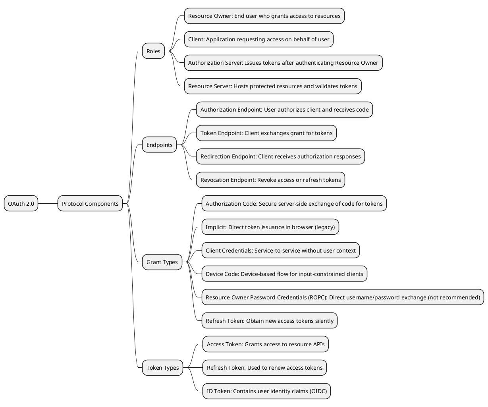
This mind-map breaks down OAuth 2.0’s core elements—roles, endpoints, grant types, and token types—showing how each component fits into the overall protocol.

### OAuth Flows in Microsoft Identity Platform
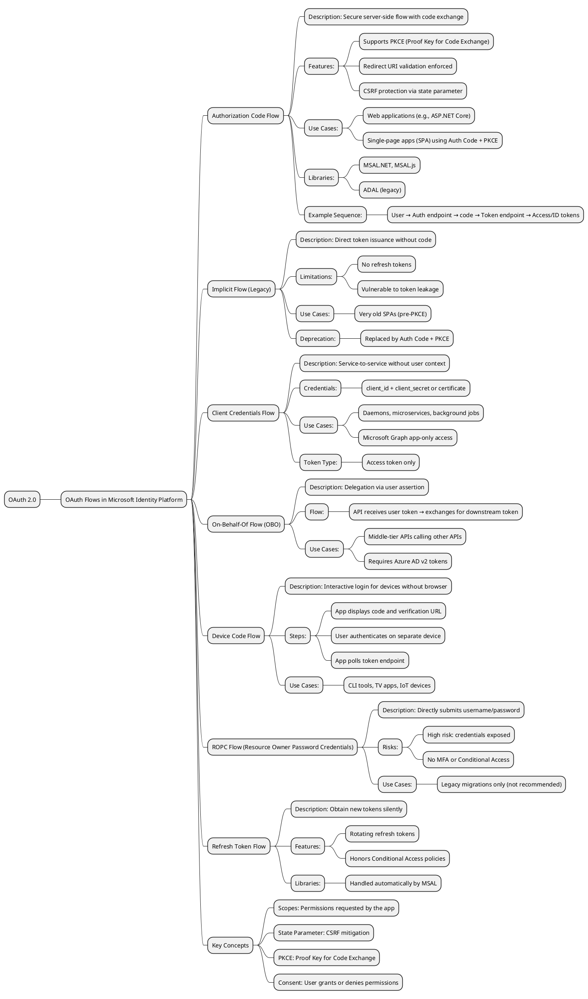
An overview of every OAuth 2.0 flow supported by Azure AD, with details on when and why to use each—ranging from secure server-side authorization code exchanges to legacy implicit and ROPC flows.

### Windows Active Directory
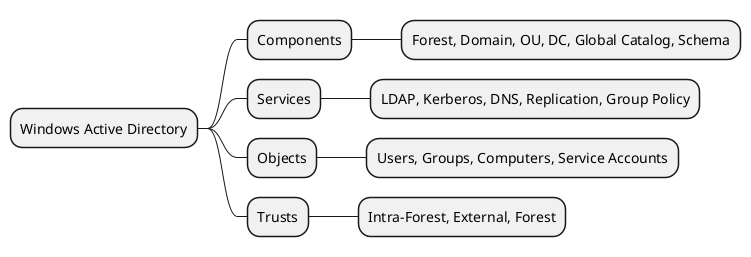
Shows on-prem AD’s structure: how forests, domains, and OUs organize objects; the services that enable directory functionality; and the trust relationships linking domains.

### LDAP Flows
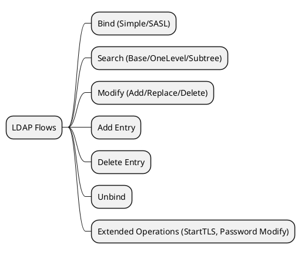
Depicts the lifecycle of an LDAP session: authenticating, querying, updating, and closing connections, as well as advanced operations like StartTLS.

### Azure Active Directory (Entra)
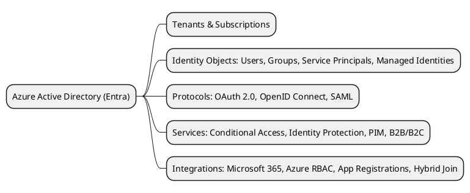
Visualizes Entra ID’s tenant model, supported identity objects, protocols, security services, and integration points with other Microsoft platforms.

### Hybrid Identity
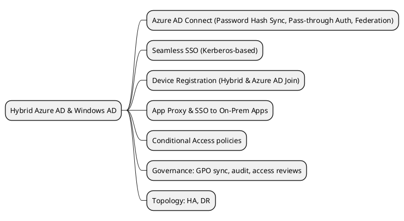
Explains how on-prem AD and Entra ID synchronize identities and enable unified authentication, from password sync to seamless SSO and device join.

---

## 1. OAuth 2.0 Fundamentals 2.0 Fundamentals

### 1.1 Protocol Components

<details>
<summary>Details & Example</summary>


**What it is**: This mind-map visually represents the core components of the OAuth 2.0 protocol and their relationships.

**How it works**: Each branch delineates a component category (roles, endpoints, grants, tokens) and its sub-elements, enabling quick comprehension of the protocol's structure.

**Python Example**:
```python
from azure.identity import DefaultAzureCredential
cred = DefaultAzureCredential()
token = cred.get_token("https://graph.microsoft.com/.default")
print(token.token)
```
</details>

### 1.2 OAuth Flows in Microsoft Identity Platform OAuth Flows in Microsoft Identity Platform

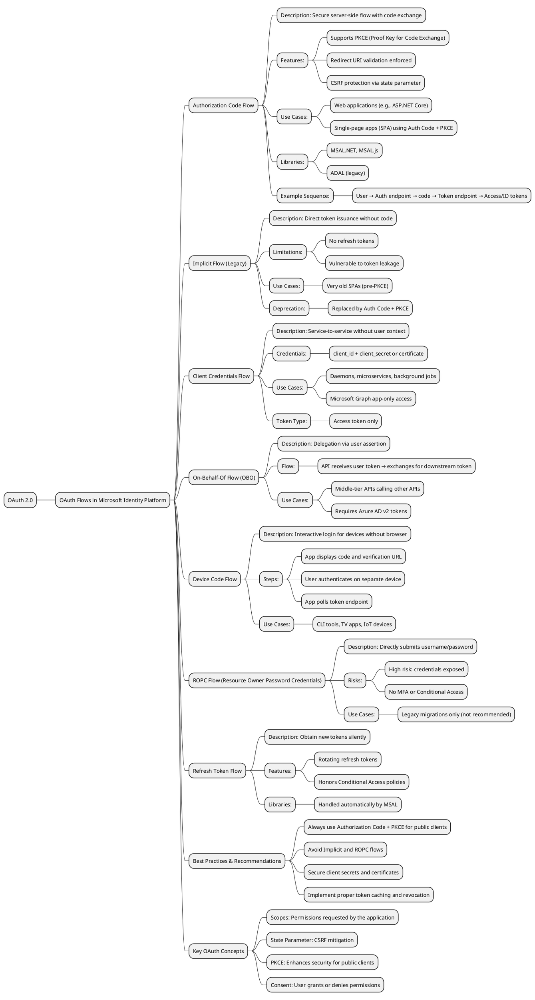

### 1.3 Flow Descriptions & Use Cases

- **Authorization Code Flow**: Server-side apps redirect users to auth endpoint, exchange code for tokens. Supports PKCE, `state`, redirect validation. Use for web apps and SPAs.
- **Implicit Flow**: Browser-based direct token issuance. No refresh tokens, vulnerable. Legacy only.
- **Client Credentials Flow**: App uses client ID & secret/certificate to get tokens without user context. For daemons, microservices.
- **On-Behalf-Of Flow**: Middle-tier API exchanges incoming user token for downstream API token. For multi-tier services.
- **Device Code Flow**: CLI/IoT apps show code & URL; user authenticates elsewhere; app polls for token.
- **ROPC Flow**: App directly submits username/password. High risk, no MFA. Legacy migrations only.
- **Refresh Token Flow**: Use refresh token to silently renew access tokens. Handled by MSAL/MSIdentity libraries.

### 1.4 Example Scenarios

1. Web application (Authorization Code)
2. SPA with PKCE (Auth Code + PKCE)
3. Daemon service (Client Credentials)
4. CLI tool (Device Code)
5. Middle-tier API (On-Behalf-Of)
6. Legacy migration (ROPC)
7. Long-lived session (Refresh Token)

### 1.5 Python Code Examples (Azure Identity)

#### 1. Authorization Code Flow

```python
from azure.identity import InteractiveBrowserCredential

cred = InteractiveBrowserCredential(
    tenant_id="<TENANT_ID>",
    client_id="<CLIENT_ID>"
)
token = cred.get_token("User.Read")
print(token.token)
```

#### 2. Implicit Flow (Manual URL Construction)

```python
import urllib.parse

params = {
    "client_id": "<CLIENT_ID>",
    "response_type": "token id_token",
    "redirect_uri": "http://localhost:5000/callback",
    "scope": "openid profile User.Read",
    "state": "12345",
    "nonce": "678910"
}
auth_url = (
    f"https://login.microsoftonline.com/<TENANT_ID>/oauth2/v2.0/authorize?" +
    urllib.parse.urlencode(params)
)
print("Open this URL in a browser:", auth_url)
```

#### 3. Client Credentials Flow

```python
from azure.identity import ClientSecretCredential

cred = ClientSecretCredential(
    tenant_id="<TENANT_ID>",
    client_id="<CLIENT_ID>",
    client_secret="<CLIENT_SECRET>"
)
token = cred.get_token("https://graph.microsoft.com/.default")
print(token.token)
```

#### 4. On-Behalf-Of Flow

```python
from azure.identity import OnBehalfOfCredential

cred = OnBehalfOfCredential(
    tenant_id="<TENANT_ID>",
    client_id="<CLIENT_ID>",
    client_secret="<CLIENT_SECRET>",
    user_assertion="<USER_ACCESS_TOKEN>"
)
token = cred.get_token("https://graph.microsoft.com/.default")
print(token.token)
```

#### 5. Device Code Flow

```python
from azure.identity import DeviceCodeCredential

cred = DeviceCodeCredential(
    client_id="<CLIENT_ID>",
    tenant_id="<TENANT_ID>"
)
token = cred.get_token("User.Read")
print(token.token)
```

#### 6. ROPC Flow

```python
from azure.identity import UsernamePasswordCredential

cred = UsernamePasswordCredential(
    client_id="<CLIENT_ID>",
    username="<USERNAME>",
    password="<PASSWORD>",
    tenant_id="<TENANT_ID>"
)
token = cred.get_token("User.Read")
print(token.token)
```

#### 7. Refresh Token Flow

```python
from azure.identity import DefaultAzureCredential

cred = DefaultAzureCredential()
# First request obtains initial token
tok1 = cred.get_token("https://graph.microsoft.com/.default")
print("Initial token:", tok1.token)
# Subsequent request triggers silent refresh
tok2 = cred.get_token("https://graph.microsoft.com/.default")
print("Refreshed token:", tok2.token)
```

---

## 2. Directory Services

### 2.1 Windows Active Directory


### 2.2 LDAP Flows

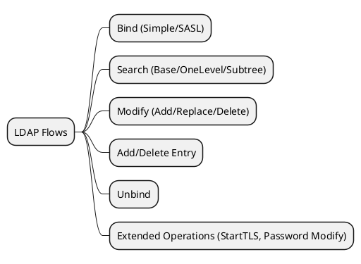

### 2.3 Querying LDAP (Python)

```python
from ldap3 import Server, Connection, ALL, SUBTREE

server = Server('ldap://ad.example.com', get_info=ALL)
conn = Connection(
    server,
    user='CN=svc_account,OU=Service Accounts,DC=example,DC=com',
    password='P@ssw0rd',
    auto_bind=True
)
conn.search(
    search_base='DC=example,DC=com',
    search_filter='(objectClass=user)',
    search_scope=SUBTREE,
    attributes=['cn', 'mail', 'memberOf']
)
for entry in conn.entries:
    print(entry)
conn.unbind()
```

---

## 3. Azure Identity Core

### 3.1 Azure Active Directory (Entra)


### 3.2 Hybrid Identity

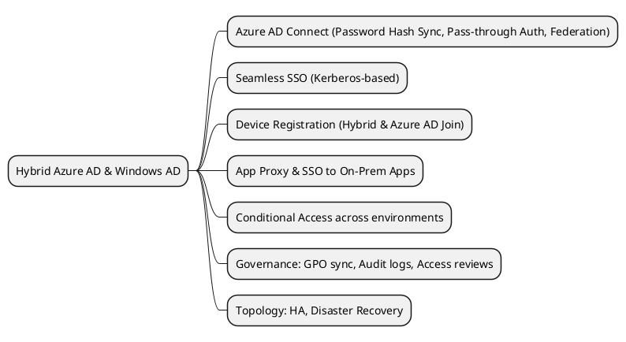

---

## 4. Azure Service Identities

### 4.1 Service Principals & Managed Identities

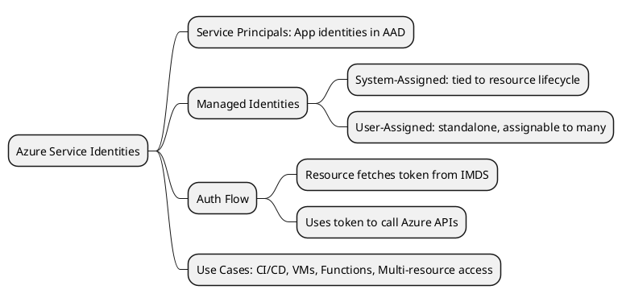

#### 4.1.1 Azure Service Principal Functionalities

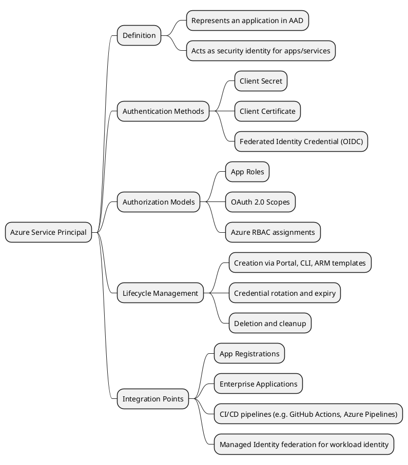

### 4.2 Workload Identity (AKS)

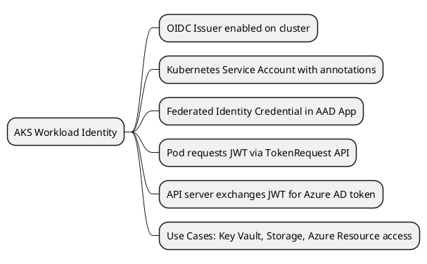

### 4.3 AKS Cluster Authentication

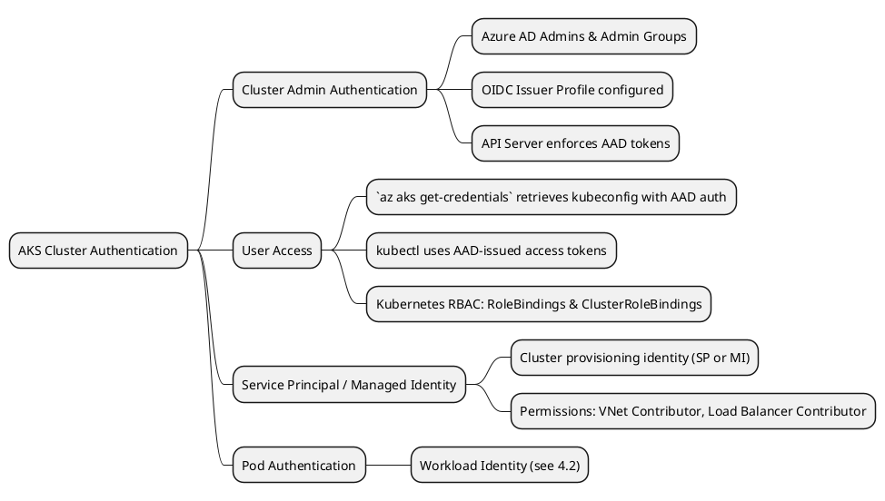

## 5. API Management. API Management

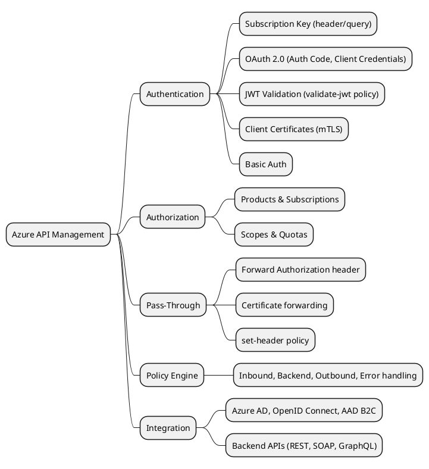

---

## 6. Azure Data Platform Authentication

### 6.1 Azure Database for PostgreSQL

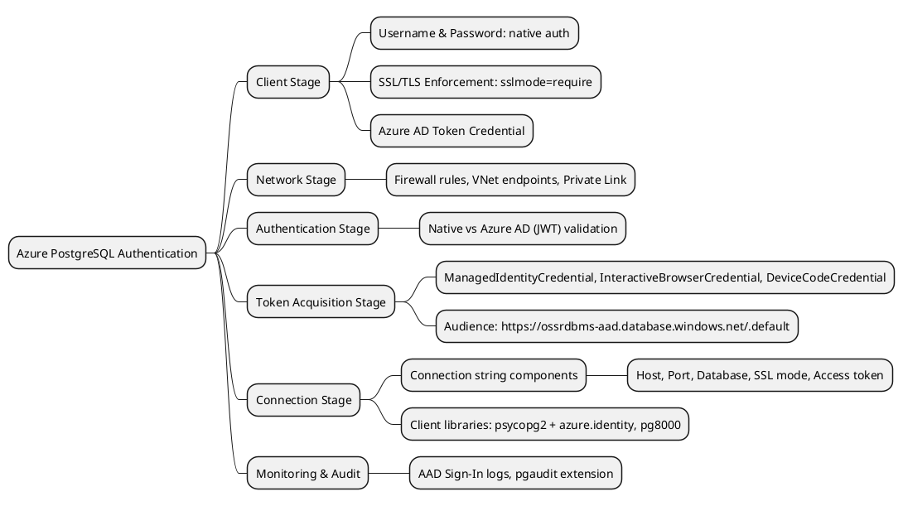

### 6.2 Azure SQL & Hyperscale

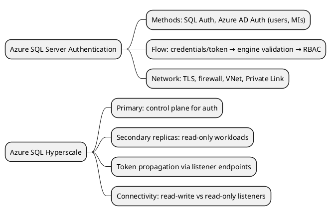

### 6.3 Azure SQL Data Warehouse

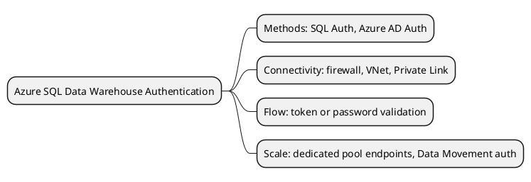

### 6.4 Azure Synapse Analytics

```puml
@startmindmap
* Azure Synapse Analytics Authentication
** Methods: SQL Auth, Azure AD Auth, Managed Identities
** Components: SQL pools, Spark pools, Integration Runtimes
** Flow: OAuth2 token acquisition → endpoint validation
** Networking: firewall, Managed VNet, Private Endpoints
** Authorization: Azure RBAC, ACLs, SAS tokens
@endmindmap
```

### 6.5 Azure Databricks

```puml
@startmindmap
* Azure Databricks Authentication
** Methods: AAD OAuth token, Personal Access Token
** Identity sources: Service Principal, Managed Identity, Users/Groups
** Token acquisition: InteractiveBrowserCredential, ClientSecretCredential, ManagedIdentityCredential
** API/JDBC auth: Bearer token in header/conn string
** Credential passthrough: SCIM, Unity Catalog
** Governance: Conditional Access, RBAC, Audit logs
@endmindmap
```

### 6.6 Control Plane Sharing

```puml
@startmindmap
* Azure & Databricks Control Planes
** Azure Control Plane: ARM, Resource Providers, AAD, Portal/CLI/API
** Databricks Control Plane: metadata, clusters, jobs, notebooks, PATs
** Data Plane: customer VNet, compute, storage (DBFS, ADLS)
** Orchestration Flow: ARM → CP deploys workspace → CP orchestrates DP via REST/gRPC
@endmindmap
```

---

## 7. Sending Email via Microsoft Graph API

```puml
@startmindmap
* Graph Email Sending
** Delegated Flow (Authorization Code)
*** User signs in and consents to `Mail.Send`
*** Client receives auth code and exchanges for tokens
*** Access token includes user context
*** Graph API call: `POST /me/sendMail`
*** Use Case: User-triggered emails (e.g., “Send on behalf of me” in web app)
** Application Flow (Client Credentials)
*** App authenticates with its own identity (service principal or managed identity)
*** ClientSecretCredential / ManagedIdentityCredential fetches token with app-level `Mail.Send` permission
*** Access token without user context
*** Graph API call: `POST /users/{user-id}/sendMail`
*** Use Case: Automated notifications and system alerts
** Token Acquisition Methods
*** Delegated: InteractiveBrowserCredential, DeviceCodeCredential
*** Application: ClientSecretCredential, CertificateCredential, ManagedIdentityCredential
** Graph Endpoint & Payload
*** Endpoint:
**** Delegated: `https://graph.microsoft.com/v1.0/me/sendMail`
**** Application: `https://graph.microsoft.com/v1.0/users/{id}/sendMail`
*** Payload Structure:
**** `message` object with `subject`, `body`, `toRecipients`, `ccRecipients`, etc.
*** Headers:
**** `Authorization: Bearer <access_token>`
**** `Content-Type: application/json`
@endmindmap
```  

## 8. Choosing OAuth Flow for Microsoft Graph API

When integrating with Microsoft Graph, select the OAuth flow based on your application context and use case.

```puml
@startmindmap
* Selecting OAuth Flow for Graph API
** Delegated (Auth Code Flow)
*** Use when: User interaction required; web apps, SPAs
*** Why: Provides user context and user consent
** Client Credentials Flow
*** Use when: No user context; background services, daemons
*** Why: Uses application identity (SP/MI)
** Device Code Flow
*** Use when: CLI tools, IoT devices without embedded browsers
*** Why: Allows code-based device login on separate device
** On-Behalf-Of Flow
*** Use when: APIs calling Graph downstream on behalf of user
*** Why: Retains user context across service layers
** ROPC Flow
*** Use when: Legacy applications requiring username/password migration (not recommended)
** Example Use Cases
*** Send mail as the signed-in user → Delegated Flow
*** Automated reports/email notifications → Client Credentials
*** CLI admin tasks → Device Code
*** API orchestration across services → On-Behalf-Of
@endmindmap
```

### Python Sample: Delegated (Authorization Code) Flow
```python
from azure.identity import InteractiveBrowserCredential
from msgraph.core import GraphClient

# Acquire token interactively
dialect = InteractiveBrowserCredential(
    tenant_id="<TENANT_ID>",
    client_id="<CLIENT_ID>"
)
token = dialect.get_token("Mail.Send User.Read")

# Initialize Graph client
graph_client = GraphClient(credential=dialect)

# Send an email
message = {
    "message": {
        "subject": "Hello via Graph API",
        "body": {"contentType": "Text", "content": "This is a test email."},
        "toRecipients": [{"emailAddress": {"address": "user@example.com"}}]
    }
}
response = graph_client.post('/me/sendMail', json=message)
print(response.status_code)
```

### Python Sample: Client Credentials Flow
```python
from azure.identity import ClientSecretCredential
from msgraph.core import GraphClient

# Acquire token with app identity
cred = ClientSecretCredential(
    tenant_id="<TENANT_ID>",
    client_id="<CLIENT_ID>",
    client_secret="<CLIENT_SECRET>"
)

graph_client = GraphClient(credential=cred)
# Send email on behalf of a specific user
message = {
    "message": {
        "subject": "Automated Report",
        "body": {"contentType": "Text", "content": "Report attached."},
        "toRecipients": [{"emailAddress": {"address": "admin@example.com"}}]
    }
}
response = graph_client.post(
    '/users/<USER_ID>/sendMail', json=message
)
print(response.status_code)
```

### Python Sample: Device Code Flow
```python
from azure.identity import DeviceCodeCredential
from msgraph.core import GraphClient

# Acquire token via device code
dev_cred = DeviceCodeCredential(
    client_id="<CLIENT_ID>",
    tenant_id="<TENANT_ID>"
)

graph_client = GraphClient(credential=dev_cred)
# List user mailbox folders
response = graph_client.get('/me/mailFolders')
print(response.json())
```

## References

- **RFC 6749**: OAuth 2.0 Authorization Framework  
- **RFC 6750**: OAuth 2.0 Bearer Token Usage  
- **RFC 7636**: Proof Key for Code Exchange (PKCE)


- **RFC 6749**: OAuth 2.0 Authorization Framework
- **RFC 6750**: OAuth 2.0 Bearer Token Usage
- **RFC 7636**: Proof Key for Code Exchange (PKCE)

