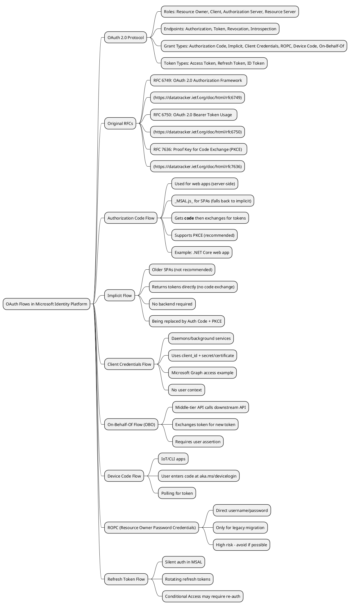
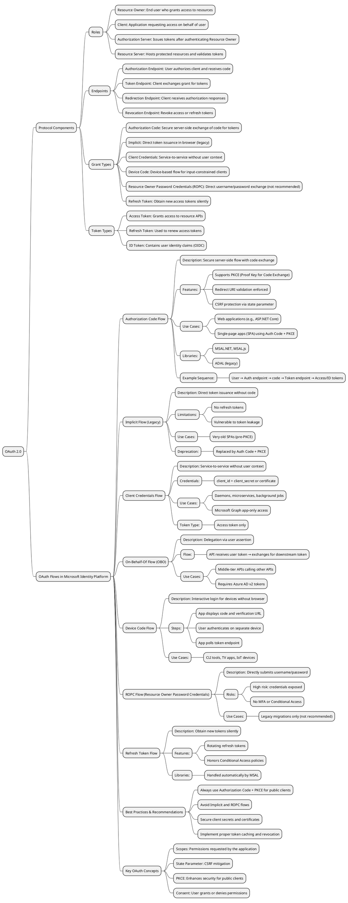

# Oauth flow

## mind map

```puml
@startmindmap
+ OAuth Flows in Microsoft Identity Platform

++ OAuth 2.0 Protocol
+++ Roles: Resource Owner, Client, Authorization Server, Resource Server
+++ Endpoints: Authorization, Token, Revocation, Introspection
+++ Grant Types: Authorization Code, Implicit, Client Credentials, ROPC, Device Code, On-Behalf-Of
+++ Token Types: Access Token, Refresh Token, ID Token

++ Original RFCs
+++ RFC 6749: OAuth 2.0 Authorization Framework  
+++ (https://datatracker.ietf.org/doc/html/rfc6749)
+++ RFC 6750: OAuth 2.0 Bearer Token Usage  
+++ (https://datatracker.ietf.org/doc/html/rfc6750)
+++ RFC 7636: Proof Key for Code Exchange (PKCE)  
+++ (https://datatracker.ietf.org/doc/html/rfc7636)

++ Authorization Code Flow
+++ Used for web apps (server-side)
+++ _MSAL.js_ for SPAs (falls back to implicit)
+++ Gets **code** then exchanges for tokens
+++ Supports PKCE (recommended)
+++ Example: .NET Core web app

++ Implicit Flow
+++ Older SPAs (not recommended)
+++ Returns tokens directly (no code exchange)
+++ No backend required
+++ Being replaced by Auth Code + PKCE

++ Client Credentials Flow
+++ Daemons/background services
+++ Uses client_id + secret/certificate
+++ Microsoft Graph access example
+++ No user context

++ On-Behalf-Of Flow (OBO)
+++ Middle-tier API calls downstream API
+++ Exchanges token for new token
+++ Requires user assertion

++ Device Code Flow
+++ IoT/CLI apps
+++ User enters code at aka.ms/devicelogin
+++ Polling for token

++ ROPC (Resource Owner Password Credentials)
+++ Direct username/password
+++ Only for legacy migration
+++ High risk - avoid if possible

++ Refresh Token Flow
+++ Silent auth in MSAL
+++ Rotating refresh tokens
+++ Conditional Access may require re-auth

@endmindmap
```

```puml
@startmindmap
* OAuth 2.0
** Protocol Components
*** Roles
**** Resource Owner: End user who grants access to resources
**** Client: Application requesting access on behalf of user
**** Authorization Server: Issues tokens after authenticating Resource Owner
**** Resource Server: Hosts protected resources and validates tokens
*** Endpoints
**** Authorization Endpoint: User authorizes client and receives code
**** Token Endpoint: Client exchanges grant for tokens
**** Redirection Endpoint: Client receives authorization responses
**** Revocation Endpoint: Revoke access or refresh tokens
*** Grant Types
**** Authorization Code: Secure server-side exchange of code for tokens
**** Implicit: Direct token issuance in browser (legacy)
**** Client Credentials: Service-to-service without user context
**** Device Code: Device-based flow for input-constrained clients
**** Resource Owner Password Credentials (ROPC): Direct username/password exchange (not recommended)
**** Refresh Token: Obtain new access tokens silently
*** Token Types
**** Access Token: Grants access to resource APIs
**** Refresh Token: Used to renew access tokens
**** ID Token: Contains user identity claims (OIDC)

** OAuth Flows in Microsoft Identity Platform
*** Authorization Code Flow
**** Description: Secure server-side flow with code exchange
**** Features:
***** Supports PKCE (Proof Key for Code Exchange)
***** Redirect URI validation enforced
***** CSRF protection via state parameter
**** Use Cases:
***** Web applications (e.g., ASP.NET Core)
***** Single-page apps (SPA) using Auth Code + PKCE
**** Libraries:
***** MSAL.NET, MSAL.js
***** ADAL (legacy)
**** Example Sequence:
***** User → Auth endpoint → code → Token endpoint → Access/ID tokens

*** Implicit Flow (Legacy)
**** Description: Direct token issuance without code
**** Limitations:
***** No refresh tokens
***** Vulnerable to token leakage
**** Use Cases:
***** Very old SPAs (pre-PKCE)
**** Deprecation:
***** Replaced by Auth Code + PKCE

*** Client Credentials Flow
**** Description: Service-to-service without user context
**** Credentials:
***** client_id + client_secret or certificate
**** Use Cases:
***** Daemons, microservices, background jobs
***** Microsoft Graph app-only access
**** Token Type:
***** Access token only

*** On-Behalf-Of Flow (OBO)
**** Description: Delegation via user assertion
**** Flow:
***** API receives user token → exchanges for downstream token
**** Use Cases:
***** Middle-tier APIs calling other APIs
***** Requires Azure AD v2 tokens

*** Device Code Flow
**** Description: Interactive login for devices without browser
**** Steps:
***** App displays code and verification URL
***** User authenticates on separate device
***** App polls token endpoint
**** Use Cases:
***** CLI tools, TV apps, IoT devices

*** ROPC Flow (Resource Owner Password Credentials)
**** Description: Directly submits username/password
**** Risks:
***** High risk: credentials exposed
***** No MFA or Conditional Access
**** Use Cases:
***** Legacy migrations only (not recommended)

*** Refresh Token Flow
**** Description: Obtain new tokens silently
**** Features:
***** Rotating refresh tokens
***** Honors Conditional Access policies
**** Libraries:
***** Handled automatically by MSAL

*** Best Practices & Recommendations
**** Always use Authorization Code + PKCE for public clients
**** Avoid Implicit and ROPC flows
**** Secure client secrets and certificates
**** Implement proper token caching and revocation

*** Key OAuth Concepts
**** Scopes: Permissions requested by the application
**** State Parameter: CSRF mitigation
**** PKCE: Enhances security for public clients
**** Consent: User grants or denies permissions
@endmindmap


```