# OAuth 2.0 Overview

A concise guide to OAuth 2.0, featuring enhanced mind-maps in PlantUML, flow explanations, real-world scenarios, and Python code samples using the Azure Identity library.

---

## Mind-Map

### Protocol Components

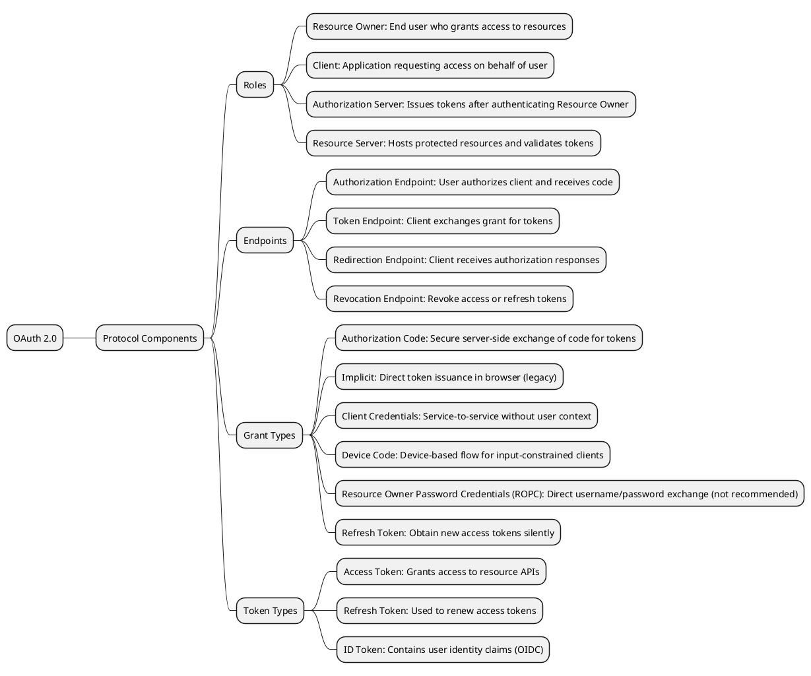
```puml
@startmindmap
* OAuth 2.0
** Protocol Components
*** Roles
**** Resource Owner: End user who grants access to resources
**** Client: Application requesting access on behalf of user
**** Authorization Server: Issues tokens after authenticating Resource Owner
**** Resource Server: Hosts protected resources and validates tokens
*** Endpoints
**** Authorization Endpoint: User authorizes client and receives code
**** Token Endpoint: Client exchanges grant for tokens
**** Redirection Endpoint: Client receives authorization responses
**** Revocation Endpoint: Revoke access or refresh tokens
*** Grant Types
**** Authorization Code: Secure server-side exchange of code for tokens
**** Implicit: Direct token issuance in browser (legacy)
**** Client Credentials: Service-to-service without user context
**** Device Code: Device-based flow for input-constrained clients
**** Resource Owner Password Credentials (ROPC): Direct username/password exchange (not recommended)
**** Refresh Token: Obtain new access tokens silently
*** Token Types
**** Access Token: Grants access to resource APIs
**** Refresh Token: Used to renew access tokens
**** ID Token: Contains user identity claims (OIDC)
@endmindmap
```

### OAuth Flows in Microsoft Identity Platform

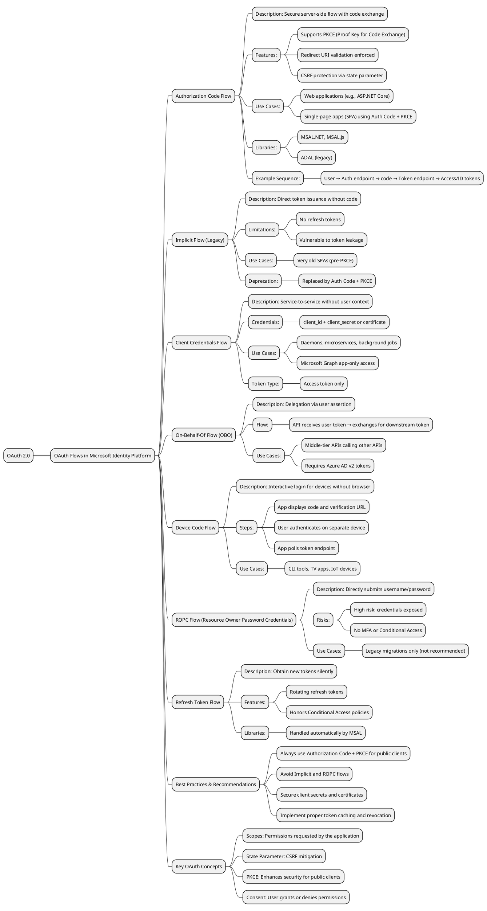
```puml
@startmindmap
* OAuth 2.0
** OAuth Flows in Microsoft Identity Platform
*** Authorization Code Flow
**** Description: Secure server-side flow with code exchange
**** Features:
***** Supports PKCE (Proof Key for Code Exchange)
***** Redirect URI validation enforced
***** CSRF protection via state parameter
**** Use Cases:
***** Web applications (e.g., ASP.NET Core)
***** Single-page apps (SPA) using Auth Code + PKCE
**** Libraries:
***** MSAL.NET, MSAL.js
***** ADAL (legacy)
**** Example Sequence:
***** User → Auth endpoint → code → Token endpoint → Access/ID tokens

*** Implicit Flow (Legacy)
**** Description: Direct token issuance without code
**** Limitations:
***** No refresh tokens
***** Vulnerable to token leakage
**** Use Cases:
***** Very old SPAs (pre-PKCE)
**** Deprecation:
***** Replaced by Auth Code + PKCE

*** Client Credentials Flow
**** Description: Service-to-service without user context
**** Credentials:
***** client_id + client_secret or certificate
**** Use Cases:
***** Daemons, microservices, background jobs
***** Microsoft Graph app-only access
**** Token Type:
***** Access token only

*** On-Behalf-Of Flow (OBO)
**** Description: Delegation via user assertion
**** Flow:
***** API receives user token → exchanges for downstream token
**** Use Cases:
***** Middle-tier APIs calling other APIs
***** Requires Azure AD v2 tokens

*** Device Code Flow
**** Description: Interactive login for devices without browser
**** Steps:
***** App displays code and verification URL
***** User authenticates on separate device
***** App polls token endpoint
**** Use Cases:
***** CLI tools, TV apps, IoT devices

*** ROPC Flow (Resource Owner Password Credentials)
**** Description: Directly submits username/password
**** Risks:
***** High risk: credentials exposed
***** No MFA or Conditional Access
**** Use Cases:
***** Legacy migrations only (not recommended)

*** Refresh Token Flow
**** Description: Obtain new tokens silently
**** Features:
***** Rotating refresh tokens
***** Honors Conditional Access policies
**** Libraries:
***** Handled automatically by MSAL

*** Best Practices & Recommendations
**** Always use Authorization Code + PKCE for public clients
**** Avoid Implicit and ROPC flows
**** Secure client secrets and certificates
**** Implement proper token caching and revocation

*** Key OAuth Concepts
**** Scopes: Permissions requested by the application
**** State Parameter: CSRF mitigation
**** PKCE: Enhances security for public clients
**** Consent: User grants or denies permissions
@endmindmap
```

---

## OAuth 2.0 Flows

### Authorization Code Flow

- **Description**: Server-side apps redirect the user to the authorization endpoint to obtain an authorization **code**, then exchange it for tokens.
- **Features**:
  - PKCE support (strongly recommended)
  - CSRF protection via `state`
  - Redirect URI validation
- **Use Cases**: Traditional web apps, SPAs with Auth Code + PKCE

---

### Implicit Flow

- **Description**: Browser-only flow returning tokens directly as URL fragments.
- **Limitations**:
  - No refresh tokens
  - Vulnerable to token leakage
- **Status**: Legacy—superseded by Auth Code + PKCE

---

### Client Credentials Flow

- **Description**: Service-to-service calls using a client ID & secret (or certificate).
- **Use Cases**: Daemons, microservices, background jobs, app-only Graph access.

---

### On-Behalf-Of (OBO) Flow

- **Description**: A middle-tier API exchanges an incoming user token for a downstream API token.
- **Use Cases**: Multi-tier/microservice architectures.

---

### Device Code Flow

- **Description**: Devices without browsers present a code/URL for the user to authenticate on another device, then poll for tokens.
- **Use Cases**: CLI tools, IoT, TV apps.

---

### Resource Owner Password Credentials (ROPC) Flow

- **Description**: App collects username/password directly.
- **Risks**: Exposes credentials; no MFA/Conditional Access.
- **Use Cases**: Legacy migrations only (not recommended).

---

### Refresh Token Flow

- **Description**: Silent token renewal using a refresh token.
- **Features**: Rotating tokens; honors Conditional Access.
- **Use Cases**: Long-lived sessions in MSAL.

---

## Example Scenarios

1. **Web application** using Authorization Code Flow
2. **Single-page app (SPA)** using Auth Code + PKCE
3. **Daemon service** using Client Credentials Flow
4. **CLI tool** using Device Code Flow
5. **Middle-tier API** using On-Behalf-Of Flow
6. **Legacy migration** using ROPC Flow
7. **Silent renewal** using Refresh Token Flow

---

## Python Code Examples (Azure Identity)

#### 1. Authorization Code Flow (InteractiveBrowserCredential)

```python
from azure.identity import InteractiveBrowserCredential

# Replace with your tenant and client details
tenant_id = "<TENANT_ID>"
client_id = "<CLIENT_ID>"

# InteractiveBrowserCredential opens the system browser to authenticate the user
enablement = InteractiveBrowserCredential(
    tenant_id=tenant_id,
    client_id=client_id
)

# Request an access token for Microsoft Graph
token = enablement.get_token("User.Read")
print("Access token:\n", token.token)
```

#### 2. Implicit Flow (Manual URL Construction)

```python
import urllib.parse

params = {
    "client_id": "<CLIENT_ID>",
    "response_type": "token id_token",
    "redirect_uri": "http://localhost:5000/redirect",
    "scope": "openid profile User.Read",
    "state": "12345",
    "nonce": "678910"
}
auth_url = (
    f"https://login.microsoftonline.com/<TENANT_ID>/oauth2/v2.0/authorize?"
    + urllib.parse.urlencode(params)
)
print("Open this URL in a browser:\n", auth_url)
```

#### 3. Client Credentials Flow (ClientSecretCredential)

```python
from azure.identity import ClientSecretCredential

credential = ClientSecretCredential(
    tenant_id="<TENANT_ID>",
    client_id="<CLIENT_ID>",
    client_secret="<CLIENT_SECRET>"
)

token = credential.get_token("https://graph.microsoft.com/.default")
print(token.token)
```

#### 4. On-Behalf-Of Flow (OnBehalfOfCredential)

```python
from azure.identity import OnBehalfOfCredential

credential = OnBehalfOfCredential(
    tenant_id="<TENANT_ID>",
    client_id="<CLIENT_ID>",
    client_secret="<CLIENT_SECRET>",
    user_assertion="<USER_ACCESS_TOKEN_FROM_FRONTEND>"
)

token = credential.get_token("https://graph.microsoft.com/.default")
print(token.token)
```

#### 5. Device Code Flow (DeviceCodeCredential)

```python
from azure.identity import DeviceCodeCredential

credential = DeviceCodeCredential(
    client_id="<CLIENT_ID>",
    tenant_id="<TENANT_ID>"
)
# Prompts user to authenticate on another device
token = credential.get_token("User.Read")
print(token.token)
```

#### 6. ROPC Flow (UsernamePasswordCredential)

```python
from azure.identity import UsernamePasswordCredential

credential = UsernamePasswordCredential(
    client_id="<CLIENT_ID>",
    username="<USERNAME>",
    password="<PASSWORD>",
    tenant_id="<TENANT_ID>"
)
token = credential.get_token("User.Read")
print(token.token)
```

#### 7. Refresh Token Flow (DefaultAzureCredential)

```python
from azure.identity import DefaultAzureCredential

# DefaultAzureCredential automatically handles token refresh
credential = DefaultAzureCredential()

token1 = credential.get_token("https://graph.microsoft.com/.default")
print("First access token:\n", token1.token)

# Later, getting a new token triggers a refresh under the hood
token2 = credential.get_token("https://graph.microsoft.com/.default")
print("Refreshed access token:\n", token2.token)
```

---

## Windows Active Directory

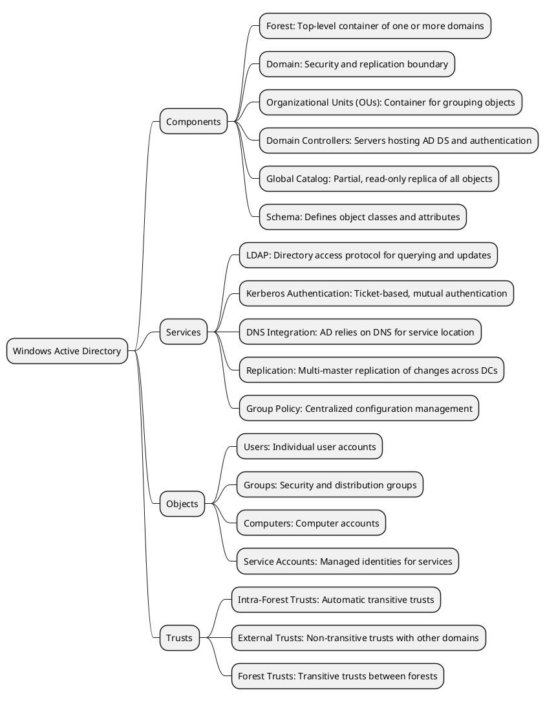
```puml
@startmindmap
* Windows Active Directory
** Components
*** Forest: Top-level container of one or more domains
*** Domain: Security and replication boundary
*** Organizational Units (OUs): Container for grouping objects
*** Domain Controllers: Servers hosting AD DS and authentication
*** Global Catalog: Partial, read-only replica of all objects
*** Schema: Defines object classes and attributes
** Services
*** LDAP: Directory access protocol for querying and updates
*** Kerberos Authentication: Ticket-based, mutual authentication
*** DNS Integration: AD relies on DNS for service location
*** Replication: Multi-master replication of changes across DCs
*** Group Policy: Centralized configuration management
** Objects
*** Users: Individual user accounts
*** Groups: Security and distribution groups
*** Computers: Computer accounts
*** Service Accounts: Managed identities for services
** Trusts
*** Intra-Forest Trusts: Automatic transitive trusts
*** External Trusts: Non-transitive trusts with other domains
*** Forest Trusts: Transitive trusts between forests
@endmindmap
```

## LDAP Flows

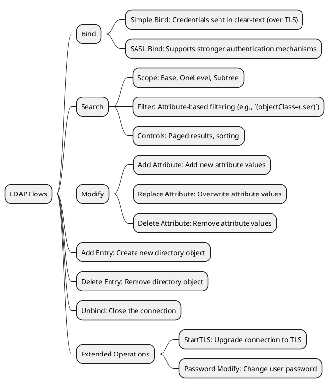
```puml
@startmindmap
* LDAP Flows
** Bind
*** Simple Bind: Credentials sent in clear-text (over TLS)
*** SASL Bind: Supports stronger authentication mechanisms
** Search
*** Scope: Base, OneLevel, Subtree
*** Filter: Attribute-based filtering (e.g., `(objectClass=user)`)
*** Controls: Paged results, sorting
** Modify
*** Add Attribute: Add new attribute values
*** Replace Attribute: Overwrite attribute values
*** Delete Attribute: Remove attribute values
** Add Entry: Create new directory object
** Delete Entry: Remove directory object
** Unbind: Close the connection
** Extended Operations
*** StartTLS: Upgrade connection to TLS
*** Password Modify: Change user password
@endmindmap
```

## Querying LDAP

When integrating with LDAP directories (e.g., Active Directory), the typical sequence is:

1. **Bind**: Authenticate to the directory (simple or SASL).
2. **Search**: Define a base DN, scope, and filter to locate entries.
3. **Process Entries**: Iterate over results and extract attributes.
4. **Unbind**: Close the connection gracefully.

```python
from ldap3 import Server, Connection, ALL, SUBTREE

# Configuration
ldap_server = 'ldap://ad.example.com'
user_dn = 'CN=svc_account,OU=Service Accounts,DC=example,DC=com'
password = 'P@ssw0rd'
base_dn = 'DC=example,DC=com'
search_filter = '(objectClass=user)'
attributes = ['cn', 'mail', 'memberOf']

# 1. Connect & Bind
server = Server(ldap_server, get_info=ALL)
conn = Connection(server, user=user_dn, password=password, auto_bind=True)

# 2. Search
conn.search(
    search_base=base_dn,
    search_filter=search_filter,
    search_scope=SUBTREE,
    attributes=attributes
)

# 3. Process Entries
for entry in conn.entries:
    print('CN:', entry.cn)
    print('Email:', entry.mail)
    print('Groups:', entry.memberOf)
    print('---')

# 4. Unbind
conn.unbind()
```

This code uses the [ldap3](https://github.com/cannatag/ldap3) library to perform a secure bind, search for all user objects under the specified base DN, and iterate through their attributes. Adjust `search_filter`, `base_dn`, and `attributes` to suit your directory schema.

## Azure Active Directory (Entra)

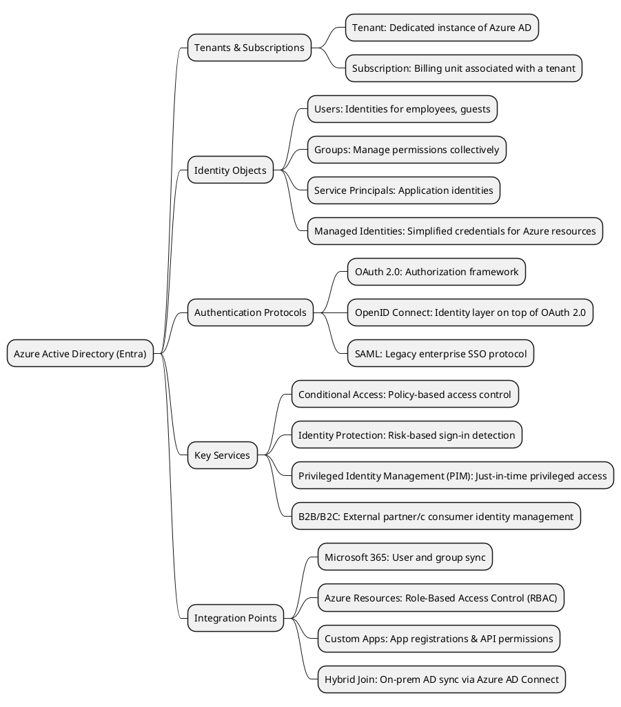
```puml
@startmindmap
* Azure Active Directory (Entra)
** Tenants & Subscriptions
*** Tenant: Dedicated instance of Azure AD
*** Subscription: Billing unit associated with a tenant
** Identity Objects
*** Users: Identities for employees, guests
*** Groups: Manage permissions collectively
*** Service Principals: Application identities
*** Managed Identities: Simplified credentials for Azure resources
** Authentication Protocols
*** OAuth 2.0: Authorization framework
*** OpenID Connect: Identity layer on top of OAuth 2.0
*** SAML: Legacy enterprise SSO protocol
** Key Services
*** Conditional Access: Policy-based access control
*** Identity Protection: Risk-based sign-in detection
*** Privileged Identity Management (PIM): Just-in-time privileged access
*** B2B/B2C: External partner/c consumer identity management
** Integration Points
*** Microsoft 365: User and group sync
*** Azure Resources: Role-Based Access Control (RBAC)
*** Custom Apps: App registrations & API permissions
*** Hybrid Join: On-prem AD sync via Azure AD Connect
@endmindmap
```

## Azure Service Identities

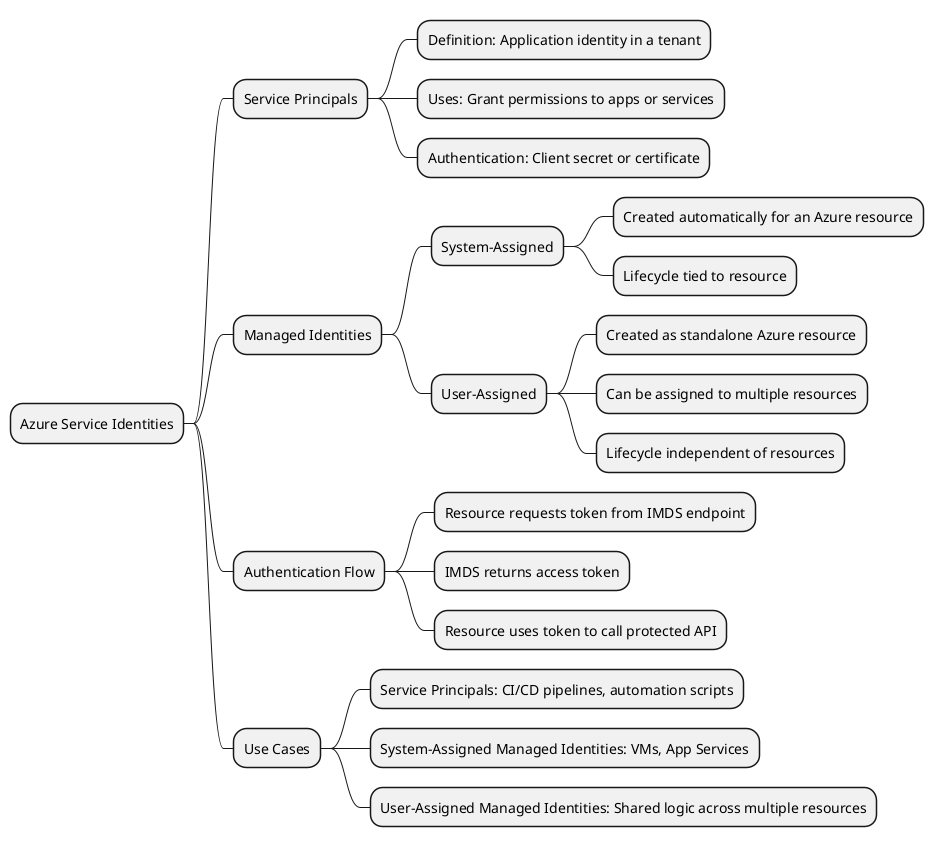
```puml
@startmindmap
* Azure Service Identities
** Service Principals
*** Definition: Application identity in a tenant
*** Uses: Grant permissions to apps or services
*** Authentication: Client secret or certificate
** Managed Identities
*** System-Assigned
**** Created automatically for an Azure resource
**** Lifecycle tied to resource
*** User-Assigned
**** Created as standalone Azure resource
**** Can be assigned to multiple resources
**** Lifecycle independent of resources
** Authentication Flow
*** Resource requests token from IMDS endpoint
*** IMDS returns access token
*** Resource uses token to call protected API
** Use Cases
*** Service Principals: CI/CD pipelines, automation scripts
*** System-Assigned Managed Identities: VMs, App Services
*** User-Assigned Managed Identities: Shared logic across multiple resources
@endmindmap
```

## Workload Identity in Azure Kubernetes Service (AKS)

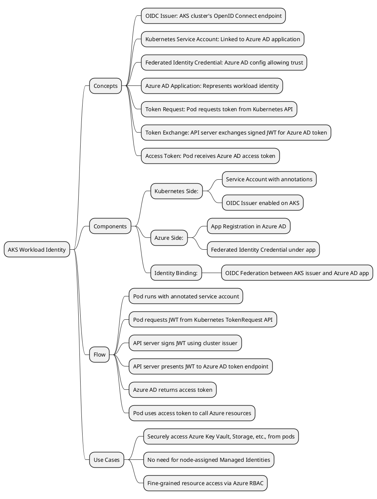
```puml
@startmindmap
* AKS Workload Identity
** Concepts
*** OIDC Issuer: AKS cluster's OpenID Connect endpoint
*** Kubernetes Service Account: Linked to Azure AD application
*** Federated Identity Credential: Azure AD config allowing trust
*** Azure AD Application: Represents workload identity
*** Token Request: Pod requests token from Kubernetes API
*** Token Exchange: API server exchanges signed JWT for Azure AD token
*** Access Token: Pod receives Azure AD access token
** Components
*** Kubernetes Side:
**** Service Account with annotations
**** OIDC Issuer enabled on AKS
*** Azure Side:
**** App Registration in Azure AD
**** Federated Identity Credential under app
*** Identity Binding:
**** OIDC Federation between AKS issuer and Azure AD app
** Flow
*** Pod runs with annotated service account
*** Pod requests JWT from Kubernetes TokenRequest API
*** API server signs JWT using cluster issuer
*** API server presents JWT to Azure AD token endpoint
*** Azure AD returns access token
*** Pod uses access token to call Azure resources
** Use Cases
*** Securely access Azure Key Vault, Storage, etc., from pods
*** No need for node-assigned Managed Identities
*** Fine-grained resource access via Azure RBAC
@endmindmap
```

## Azure API Management

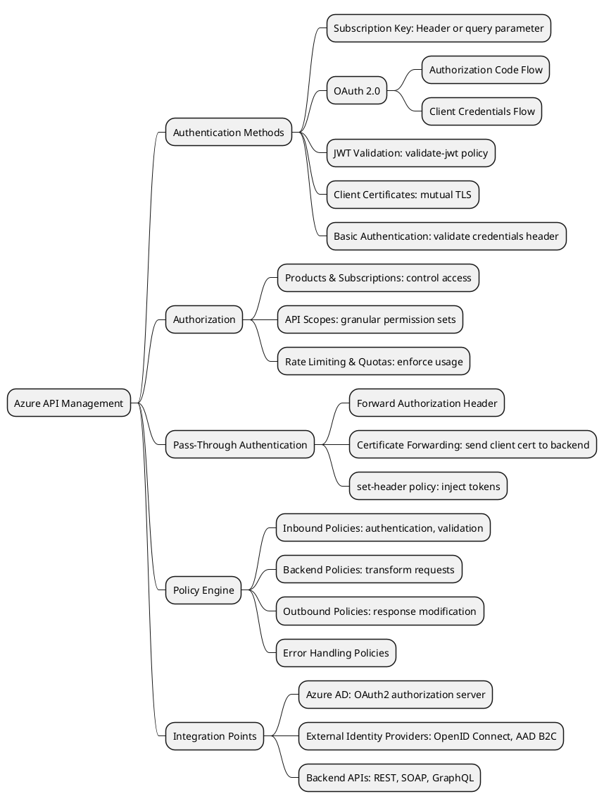
```puml
@startmindmap
* Azure API Management
** Authentication Methods
*** Subscription Key: Header or query parameter
*** OAuth 2.0
**** Authorization Code Flow
**** Client Credentials Flow
*** JWT Validation: validate-jwt policy
*** Client Certificates: mutual TLS
*** Basic Authentication: validate credentials header
** Authorization
*** Products & Subscriptions: control access
*** API Scopes: granular permission sets
*** Rate Limiting & Quotas: enforce usage
** Pass-Through Authentication
*** Forward Authorization Header
*** Certificate Forwarding: send client cert to backend
*** set-header policy: inject tokens
** Policy Engine
*** Inbound Policies: authentication, validation
*** Backend Policies: transform requests
*** Outbound Policies: response modification
*** Error Handling Policies
** Integration Points
*** Azure AD: OAuth2 authorization server
*** External Identity Providers: OpenID Connect, AAD B2C
*** Backend APIs: REST, SOAP, GraphQL
@endmindmap
```

## Databricks & Azure Control Plane

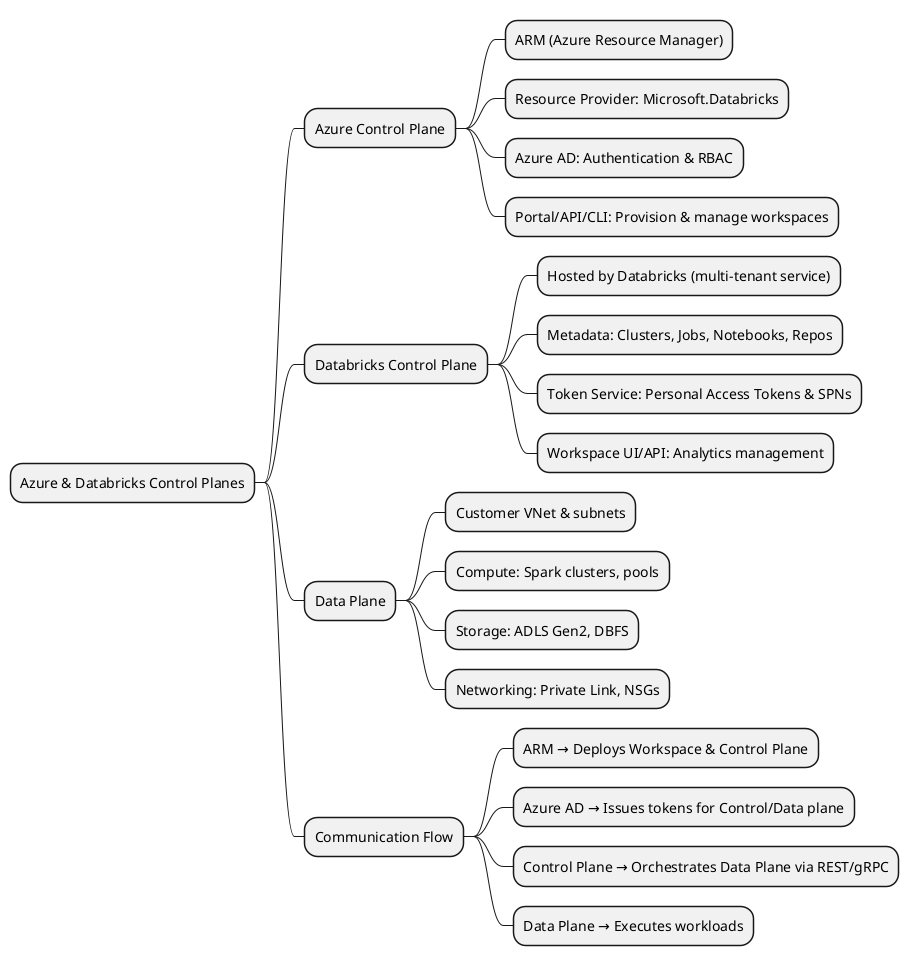
```puml
@startmindmap
* Azure & Databricks Control Planes
** Azure Control Plane
*** ARM (Azure Resource Manager)
*** Resource Provider: Microsoft.Databricks
*** Azure AD: Authentication & RBAC
*** Portal/API/CLI: Provision & manage workspaces
** Databricks Control Plane
*** Hosted by Databricks (multi-tenant service)
*** Metadata: Clusters, Jobs, Notebooks, Repos
*** Token Service: Personal Access Tokens & SPNs
*** Workspace UI/API: Analytics management
** Data Plane
*** Customer VNet & subnets
*** Compute: Spark clusters, pools
*** Storage: ADLS Gen2, DBFS
*** Networking: Private Link, NSGs
** Communication Flow
*** ARM → Deploys Workspace & Control Plane
*** Azure AD → Issues tokens for Control/Data plane
*** Control Plane → Orchestrates Data Plane via REST/gRPC
*** Data Plane → Executes workloads
@endmindmap
```

## Hybrid Azure AD & Windows AD Integration

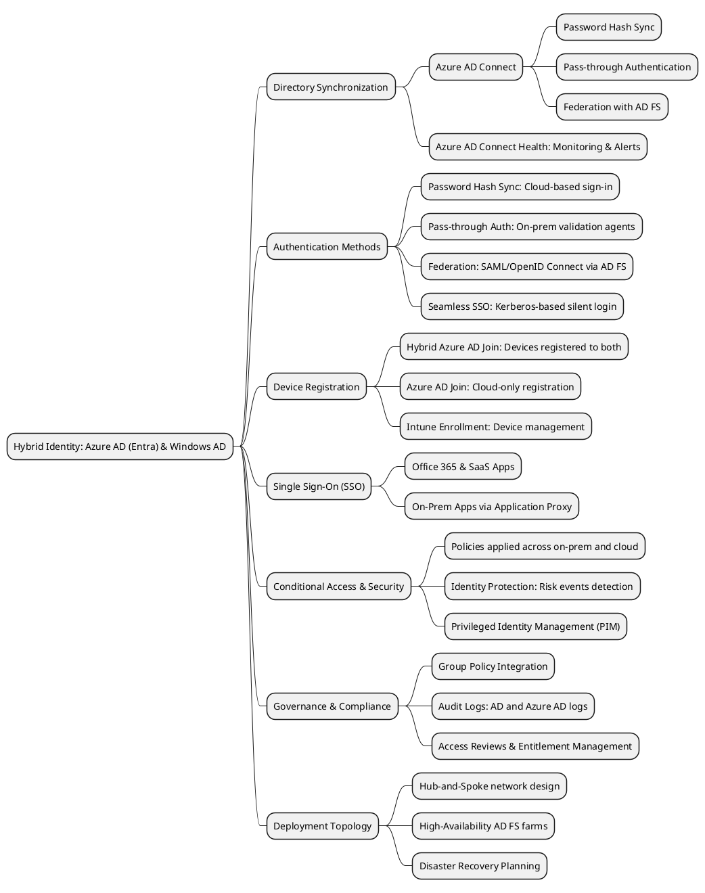
```puml
@startmindmap
* Hybrid Identity: Azure AD (Entra) & Windows AD
** Directory Synchronization
*** Azure AD Connect
**** Password Hash Sync
**** Pass-through Authentication
**** Federation with AD FS
*** Azure AD Connect Health: Monitoring & Alerts
** Authentication Methods
*** Password Hash Sync: Cloud-based sign-in
*** Pass-through Auth: On-prem validation agents
*** Federation: SAML/OpenID Connect via AD FS
*** Seamless SSO: Kerberos-based silent login
** Device Registration
*** Hybrid Azure AD Join: Devices registered to both
*** Azure AD Join: Cloud-only registration
*** Intune Enrollment: Device management
** Single Sign-On (SSO)
*** Office 365 & SaaS Apps
*** On-Prem Apps via Application Proxy
** Conditional Access & Security
*** Policies applied across on-prem and cloud
*** Identity Protection: Risk events detection
*** Privileged Identity Management (PIM)
** Governance & Compliance
*** Group Policy Integration
*** Audit Logs: AD and Azure AD logs
*** Access Reviews & Entitlement Management
** Deployment Topology
*** Hub-and-Spoke network design
*** High-Availability AD FS farms
*** Disaster Recovery Planning
@endmindmap
```

## Azure Database for PostgreSQL Authentication

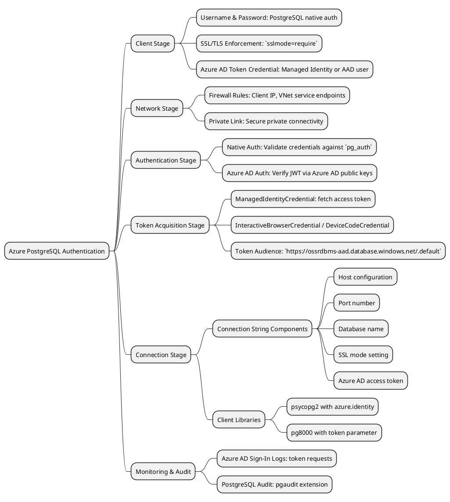
```puml
@startmindmap
* Azure PostgreSQL Authentication
** Client Stage
*** Username & Password: PostgreSQL native auth
*** SSL/TLS Enforcement: `sslmode=require`
*** Azure AD Token Credential: Managed Identity or AAD user
** Network Stage
*** Firewall Rules: Client IP, VNet service endpoints
*** Private Link: Secure private connectivity
** Authentication Stage
*** Native Auth: Validate credentials against `pg_auth`
*** Azure AD Auth: Verify JWT via Azure AD public keys
** Token Acquisition Stage
*** ManagedIdentityCredential: fetch access token
*** InteractiveBrowserCredential / DeviceCodeCredential
*** Token Audience: `https://ossrdbms-aad.database.windows.net/.default`
** Connection Stage
*** Connection String Components
**** Host configuration
**** Port number
**** Database name
**** SSL mode setting
**** Azure AD access token
*** Client Libraries
**** psycopg2 with azure.identity
**** pg8000 with token parameter
** Monitoring & Audit
*** Azure AD Sign-In Logs: token requests
*** PostgreSQL Audit: pgaudit extension
@endmindmap

```

## Azure SQL Authentication

### Azure SQL Server Authentication

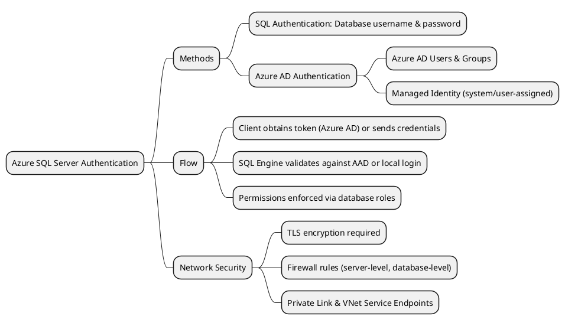
```puml
@startmindmap
* Azure SQL Server Authentication
** Methods
*** SQL Authentication: Database username & password
*** Azure AD Authentication
**** Azure AD Users & Groups
**** Managed Identity (system/user-assigned)
** Flow
*** Client obtains token (Azure AD) or sends credentials
*** SQL Engine validates against AAD or local login
*** Permissions enforced via database roles
** Network Security
*** TLS encryption required
*** Firewall rules (server-level, database-level)
*** Private Link & VNet Service Endpoints
@endmindmap
```

### Azure SQL Hyperscale Authentication

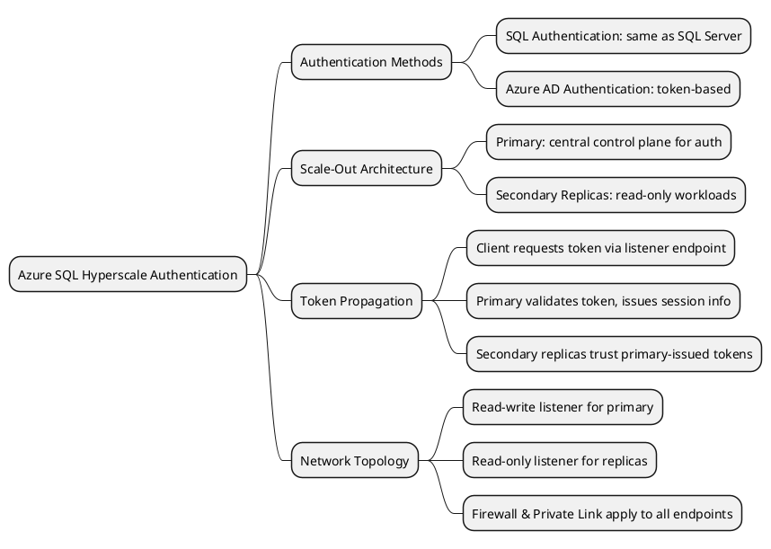
```puml
@startmindmap
* Azure SQL Hyperscale Authentication
** Authentication Methods
*** SQL Authentication: same as SQL Server
*** Azure AD Authentication: token-based
** Scale-Out Architecture
*** Primary: central control plane for auth
*** Secondary Replicas: read-only workloads
** Token Propagation
*** Client requests token via listener endpoint
*** Primary validates token, issues session info
*** Secondary replicas trust primary-issued tokens
** Network Topology
*** Read-write listener for primary
*** Read-only listener for replicas
*** Firewall & Private Link apply to all endpoints
@endmindmap
```

## Azure SQL Data Warehouse Authentication

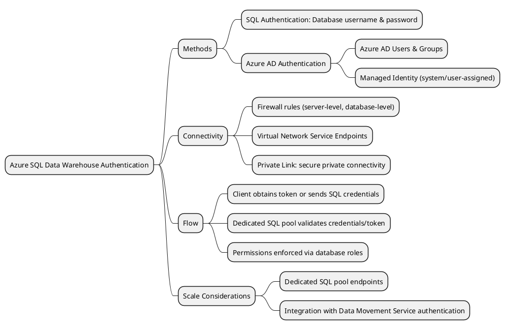
```puml
@startmindmap
* Azure SQL Data Warehouse Authentication
** Methods
*** SQL Authentication: Database username & password
*** Azure AD Authentication
**** Azure AD Users & Groups
**** Managed Identity (system/user-assigned)
** Connectivity
*** Firewall rules (server-level, database-level)
*** Virtual Network Service Endpoints
*** Private Link: secure private connectivity
** Flow
*** Client obtains token or sends SQL credentials
*** Dedicated SQL pool validates credentials/token
*** Permissions enforced via database roles
** Scale Considerations
*** Dedicated SQL pool endpoints
*** Integration with Data Movement Service authentication
@endmindmap
```

## Azure Synapse Analytics Authentication

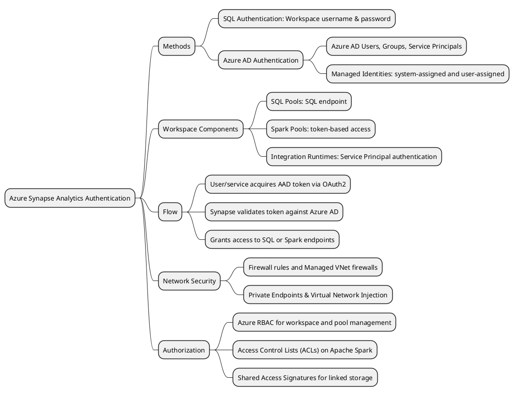
```puml
@startmindmap
* Azure Synapse Analytics Authentication
** Methods
*** SQL Authentication: Workspace username & password
*** Azure AD Authentication
**** Azure AD Users, Groups, Service Principals
**** Managed Identities: system-assigned and user-assigned
** Workspace Components
*** SQL Pools: SQL endpoint
*** Spark Pools: token-based access
*** Integration Runtimes: Service Principal authentication
** Flow
*** User/service acquires AAD token via OAuth2
*** Synapse validates token against Azure AD
*** Grants access to SQL or Spark endpoints
** Network Security
*** Firewall rules and Managed VNet firewalls
*** Private Endpoints & Virtual Network Injection
** Authorization
*** Azure RBAC for workspace and pool management
*** Access Control Lists (ACLs) on Apache Spark
*** Shared Access Signatures for linked storage
@endmindmap
```

## Azure Databricks Authentication

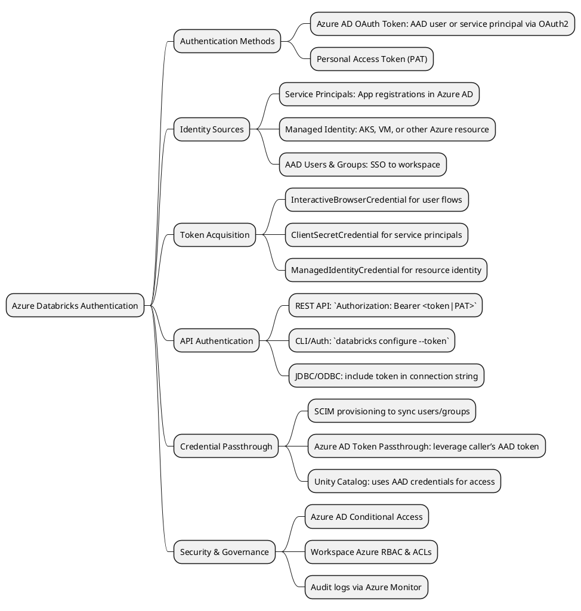
```puml
@startmindmap
* Azure Databricks Authentication
** Authentication Methods
*** Azure AD OAuth Token: AAD user or service principal via OAuth2
*** Personal Access Token (PAT)
** Identity Sources
*** Service Principals: App registrations in Azure AD
*** Managed Identity: AKS, VM, or other Azure resource
*** AAD Users & Groups: SSO to workspace
** Token Acquisition
*** InteractiveBrowserCredential for user flows
*** ClientSecretCredential for service principals
*** ManagedIdentityCredential for resource identity
** API Authentication
*** REST API: `Authorization: Bearer <token|PAT>`
*** CLI/Auth: `databricks configure --token`
*** JDBC/ODBC: include token in connection string
** Credential Passthrough
*** SCIM provisioning to sync users/groups
*** Azure AD Token Passthrough: leverage caller’s AAD token
*** Unity Catalog: uses AAD credentials for access
** Security & Governance
*** Azure AD Conditional Access
*** Workspace Azure RBAC & ACLs
*** Audit logs via Azure Monitor
@endmindmap
```

## References

- RFC 6749: OAuth 2.0 Authorization Framework — [https://datatracker.ietf.org/doc/html/rfc6749](https://datatracker.ietf.org/doc/html/rfc6749)
- RFC 6750: OAuth 2.0 Bearer Token Usage — [https://datatracker.ietf.org/doc/html/rfc6750](https://datatracker.ietf.org/doc/html/rfc6750)
- RFC 7636: Proof Key for Code Exchange (PKCE) — [https://datatracker.ietf.org/doc/html/rfc7636](https://datatracker.ietf.org/doc/html/rfc7636)

